# Prompt:
You are a strict UML evaluator. Score this class diagram against the
code using integers 1–5:

1. Completeness: Are all components from the code represented?
2. Correctness: Are relationships and multiplicities accurate?
3. Standards Adherence: Is the Mermaid syntax valid?
4. Comprehensibility: Is the diagram readable?
5. Terminological Alignment: Do names match the domain?

If any score is below 4, output the corrected Mermaid code.

Code scope is here:
### Core Data Models & State (Highly Relevant)
These files contain the primary classes that define the state and components of the game:
*   **`src/blokus/models.py`**: This is the absolute center of the game's architecture. It contains:
    *   `GameState`: Represents the complete, mutable state of a Blokus session (the board, history, players, remaining pieces).
    *   `Move`: Represents a single attempted or completed piece placement.
    *   `ValidationResult`: A simple wrapper for the result of rule checks.
*   **`src/blokus/pieces.py`**: Manages the geometric representation of the polyominoes.
    *   `PieceDefinition`: Defines the shape structure and pre-calculates variants.
    *   `Transform`: Represents the rotation and flip states of a piece.
*   **`src/blokus/config.py`**: Defines the static rules for different game variations (Standard vs. Duo).
    *   `ModeConfig`: Configuration class for board size, player count, and starting corners.

### Engine Logic (Functional Modules)

*   **`src/blokus/engine.py`**: The central rule engine. It contains purely functional logic like `apply_move`, `validate_move`, and `score_player` that operate on the `GameState`.
*   **`src/blokus/players.py`**: Contains the decision-making functions (`choose_move`, `choose_simple_move`) for various player strategies (Human vs. AI).

### Graphical Interface
If your diagram should also cover how the game engine interacts with the screen, you would include:
*   **`src/blokus/gui.py`**: Contains `BlokusGui`, `DragState`, and `PieceRenderLayout`.
*   **`src/blokus/gui_support.py`**: Contains `BoardMetrics` and `SidebarPieceSlot`.

### EXCLUDE THESE FILES FROM THE CLASS DIAGRAM. 
To keep the diagram focused purely on the game and engine:
*   **`src/blokus/review/*`**: The entire directory containing agentic review tools (`coordinator.py`, `renderer.py`, etc.).
*   **`src/blokus/automation.py` & `src/blokus/evaluate.py`**: Used for autonomous testing and scenario evaluation.
*   **`src/blokus/cli.py`**: The command-line entry points.

# Response:
 Viewed blokus_class_diagram.mmd:1-138
Viewed models.py:1-235
Viewed pieces.py:1-144
Viewed config.py:1-71
Viewed engine.py:1-406
Viewed players.py:1-46
Viewed gui.py:1-800
Viewed gui_support.py:1-245

Here is the strict UML evaluation of your Mermaid class diagram against the provided codebase:

1. **Completeness: 4**
   - *Reasoning*: The diagram captures the core architecture wonderfully. However, it misses a few notable elements: the public `validate_pass` method in the `Engine` module, the `advance_automatic_turns` method in `BlokusGui`, and crucial `| None` return types in the `Players` module (since mathematically, blocked players return `None`).
2. **Correctness: 4**
   - *Reasoning*: Multiplicities and structural relationships (compositions and dependencies) are highly accurate. However, several method signatures miss optional parameter annotations (e.g., `player: str | None = None` in `list_legal_moves`). Additionally, `GameState.board` uses `Optional[str]` which is semantically fine but differs from the explicit `str | None` union used in the Python code.
3. **Standards Adherence: 3**
   - *Reasoning*: The syntax contains several violations that will cause parsing errors in standard Mermaid renderers. In Mermaid, attributes must be declared as `[visibility]type name` (e.g., `+int board_size`), rather than the Python-style `+name: type`. Furthermore, using brackets `[]` for generic types (like `dict[str, object]` or `list[list[Optional[str]]]`) is invalid in Mermaid; standard Mermaid generics require tildes (e.g., `dict~str, object~`).
4. **Comprehensibility: 5**
   - *Reasoning*: The diagram is visually logical, well-structured, and does a fantastic job of differentiating functional modules (`<<module>>`) from strictly object-oriented data structures.
5. **Terminological Alignment: 5**
   - *Reasoning*: The class names, properties, and method names perfectly mirror the domain language used in the `blokus` codebase.

***

Because the **Standards Adherence** score is below 4, here is the fully corrected Mermaid code ensuring strict validity and accurate types:

```mermaid
classDiagram
    class ModeConfig {
        +str name
        +int board_size
        +tuple~str~ players
        +dict~str, tuple~int, int~~ start_corners
    }

    class Move {
        +str player
        +str piece
        +int x
        +int y
        +int rotation
        +bool flipped
        +to_dict() dict~str, object~
        +from_dict(data: dict~str, object~)$ Move
    }

    class ValidationResult {
        +bool ok
        +str reason
    }

    class GameState {
        +str mode
        +list~list~str | None~~ board
        +tuple~str~ players
        +dict~str, tuple~int, int~~ start_corners
        +dict~str, set~str~~ remaining_pieces
        +list~Move~ history
        +int current_player_index
        +int consecutive_passes
        +bool finished
        +dict~str, str~ controller_types
        +dict~str, str~ controller_strategies
        -dict~str, set~tuple~int, int~~~ occupied_cells_by_player
        +board_size() int
        +current_player() str
        +clone() GameState
        +to_dict() dict~str, object~
        +from_dict(data: dict~str, object~)$ GameState
    }

    class Transform {
        +int rotation
        +bool flipped
        +tuple~tuple~int, int~~ cells
    }

    class PieceDefinition {
        +str piece_id
        +tuple~tuple~int, int~~ cells
        +tuple~Transform~ transforms
        +size() int
    }

    class Engine {
        <<module>>
        +new_game(mode: str, controllers: dict, strategies: dict)$ GameState
        +validate_move(state: GameState, move: Move)$ ValidationResult
        +list_legal_moves(state: GameState, player: str | None, limit: int | None)$ list~Move~
        +apply_move(state: GameState, move: Move)$ GameState
        +validate_pass(state: GameState, player: str | None)$ ValidationResult
        +pass_turn(state: GameState, player: str | None)$ GameState
        +score_player(state: GameState, player: str)$ int
        +compute_scores(state: GameState)$ dict~str, int~
        +validate_loaded_state(loaded: GameState)$ None
        +occupied_square_counts(state: GameState)$ dict~str, int~
    }

    class Players {
        <<module>>
        +choose_simple_move(state: GameState, player: str | None)$ Move | None
        +available_strategies()$ tuple~str~
        +choose_move(state: GameState, player: str | None, strategy: str)$ Move | None
    }

    class DragState {
        +str piece_id
        +tuple~int, int~ base_cell
        +int rotation
        +bool flipped
    }

    class PieceRenderLayout {
        +tuple~float, float, float, float~ bbox
        +dict~tuple~int, int~, tuple~float, float, float, float~~ cell_rects
    }

    class SidebarPieceSlot {
        +tuple~float, float, float, float~ bbox
        +tuple~tuple~int, int~~ normalized_shape
        +dict~tuple~int, int~, tuple~float, float, float, float~~ cell_rects
    }

    class BoardMetrics {
        +int board_x
        +int board_y
        +int display_size
        +grid_origin_x() float
        +grid_origin_y() float
        +cell_size() float
    }

    class BlokusGui {
        +tk.Tk root
        +GameState state
        +BoardMetrics board_metrics
        +DragState drag_state
        +dict~str, PieceRenderLayout~ piece_layouts
        +dict~str, SidebarPieceSlot~ piece_slots
        +run() None
        +redraw() None
        +draw_sidebar_overlays() None
        +draw_board_state() None
        +draw_status_panel() None
        +draw_piece_panel() None
        +draw_drag_preview() None
        +on_motion(event: tk.Event) None
        +on_button_press(event: tk.Event) None
        +on_button_release(event: tk.Event) None
        +rotate_drag_clockwise(event: tk.Event) None
        +flip_drag_piece(event: tk.Event) None
        +advance_automatic_turns() None
    }

    GameState "1" *-- "*" Move : contains
    PieceDefinition "1" *-- "*" Transform : uses
    BlokusGui "1" *-- "1" GameState : manages
    BlokusGui "1" *-- "1" BoardMetrics : uses
    BlokusGui "1" *-- "0..1" DragState : tracks
    BlokusGui "1" *-- "*" PieceRenderLayout : renders
    BlokusGui "1" *-- "*" SidebarPieceSlot : contains
    Engine ..> GameState : operates on
    Engine ..> Move : validates / applies
    Engine ..> ValidationResult : produces
    Players ..> GameState : analyzes
    Players ..> Move : generates
```

