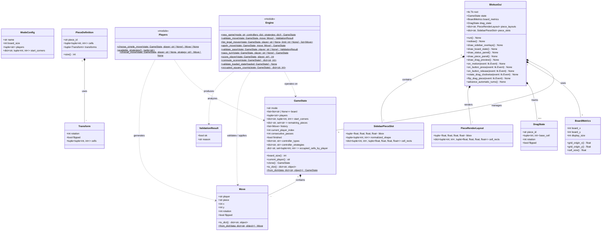

```mermaid
classDiagram
    class ModeConfig {
        +str name
        +int board_size
        +tuple~str~ players
        +dict~str, tuple~int, int~~ start_corners
    }

    class Move {
        +str player
        +str piece
        +int x
        +int y
        +int rotation
        +bool flipped
        +to_dict() dict~str, object~
        +from_dict(data: dict~str, object~)$ Move
    }

    class ValidationResult {
        +bool ok
        +str reason
    }

    class GameState {
        +str mode
        +list~list~str | None~~ board
        +tuple~str~ players
        +dict~str, tuple~int, int~~ start_corners
        +dict~str, set~str~~ remaining_pieces
        +list~Move~ history
        +int current_player_index
        +int consecutive_passes
        +bool finished
        +dict~str, str~ controller_types
        +dict~str, str~ controller_strategies
        -dict~str, set~tuple~int, int~~~ occupied_cells_by_player
        +board_size() int
        +current_player() str
        +clone() GameState
        +to_dict() dict~str, object~
        +from_dict(data: dict~str, object~)$ GameState
    }

    class Transform {
        +int rotation
        +bool flipped
        +tuple~tuple~int, int~~ cells
    }

    class PieceDefinition {
        +str piece_id
        +tuple~tuple~int, int~~ cells
        +tuple~Transform~ transforms
        +size() int
    }

    class Engine {
        <<module>>
        +new_game(mode: str, controllers: dict, strategies: dict)$ GameState
        +validate_move(state: GameState, move: Move)$ ValidationResult
        +list_legal_moves(state: GameState, player: str | None, limit: int | None)$ list~Move~
        +apply_move(state: GameState, move: Move)$ GameState
        +validate_pass(state: GameState, player: str | None)$ ValidationResult
        +pass_turn(state: GameState, player: str | None)$ GameState
        +score_player(state: GameState, player: str)$ int
        +compute_scores(state: GameState)$ dict~str, int~
        +validate_loaded_state(loaded: GameState)$ None
        +occupied_square_counts(state: GameState)$ dict~str, int~
    }

    class Players {
        <<module>>
        +choose_simple_move(state: GameState, player: str | None)$ Move | None
        +available_strategies()$ tuple~str~
        +choose_move(state: GameState, player: str | None, strategy: str)$ Move | None
    }

    class DragState {
        +str piece_id
        +tuple~int, int~ base_cell
        +int rotation
        +bool flipped
    }

    class PieceRenderLayout {
        +tuple~float, float, float, float~ bbox
        +dict~tuple~int, int~, tuple~float, float, float, float~~ cell_rects
    }

    class SidebarPieceSlot {
        +tuple~float, float, float, float~ bbox
        +tuple~tuple~int, int~~ normalized_shape
        +dict~tuple~int, int~, tuple~float, float, float, float~~ cell_rects
    }

    class BoardMetrics {
        +int board_x
        +int board_y
        +int display_size
        +grid_origin_x() float
        +grid_origin_y() float
        +cell_size() float
    }

    class BlokusGui {
        +tk.Tk root
        +GameState state
        +BoardMetrics board_metrics
        +DragState drag_state
        +dict~str, PieceRenderLayout~ piece_layouts
        +dict~str, SidebarPieceSlot~ piece_slots
        +run() None
        +redraw() None
        +draw_sidebar_overlays() None
        +draw_board_state() None
        +draw_status_panel() None
        +draw_piece_panel() None
        +draw_drag_preview() None
        +on_motion(event: tk.Event) None
        +on_button_press(event: tk.Event) None
        +on_button_release(event: tk.Event) None
        +rotate_drag_clockwise(event: tk.Event) None
        +flip_drag_piece(event: tk.Event) None
        +advance_automatic_turns() None
    }

    GameState "1" *-- "*" Move : contains
    PieceDefinition "1" *-- "*" Transform : uses
    BlokusGui "1" *-- "1" GameState : manages
    BlokusGui "1" *-- "1" BoardMetrics : uses
    BlokusGui "1" *-- "0..1" DragState : tracks
    BlokusGui "1" *-- "*" PieceRenderLayout : renders
    BlokusGui "1" *-- "*" SidebarPieceSlot : contains
    Engine ..> GameState : operates on
    Engine ..> Move : validates / applies
    Engine ..> ValidationResult : produces
    Players ..> GameState : analyzes
    Players ..> Move : generates
```