# Prompt:
Model: Gemini 3.1 Pro (High)
You are Andrej, an expert software engineer with 10 years of experience in software engineering, specialized in UML diagram generation and analysis.

Your new project is to generate a class diagram for the Blokus game engine.
The Class Diagram should focus on the game and the engine itself, not on the agentic review tools. Include GUI as well.
Use Mermaid UML.

Architecture and Design is already selected and implemented. You need to understand the codebase and create a class diagram. 

Follow these steps:
1. extract entities from code → define relationships → format output → validate
2. For behavioral features, use a two-step pipeline: generate the static model first

Output strictly in valid MermaidLLM code". conversational text outside code blocks is forbidden. Use concrete data types (no `<Type>` placeholders), visibility markers (`+`, `#`, `-`), and valid arrow syntax and advanced constructs (e.g. enumerations) 

You will 
- No dual representations (e.g., both an Enumeration and subclasses for the same type).
- No modeling of temporary method parameters as structural associations.

Steps for classdiagrams
(a) extract entities and roles, (b) define attributes with concrete types, (c) decide inheritance and interfaces, (d) assign associations with multiplicities, and (e) sanity-check the syntax before outputting the final code.

To generate a class diagram focusing purely on the game's internal data structures, state management, and engine, the following files are the most relevant:

### Core Data Models & State (Highly Relevant)
These files contain the primary classes that define the state and components of the game:
*   **`src/blokus/models.py`**: This is the absolute center of the game's architecture. It contains:
    *   `GameState`: Represents the complete, mutable state of a Blokus session (the board, history, players, remaining pieces).
    *   `Move`: Represents a single attempted or completed piece placement.
    *   `ValidationResult`: A simple wrapper for the result of rule checks.
*   **`src/blokus/pieces.py`**: Manages the geometric representation of the polyominoes.
    *   `PieceDefinition`: Defines the shape structure and pre-calculates variants.
    *   `Transform`: Represents the rotation and flip states of a piece.
*   **`src/blokus/config.py`**: Defines the static rules for different game variations (Standard vs. Duo).
    *   `ModeConfig`: Configuration class for board size, player count, and starting corners.

### Engine Logic (Functional Modules)
*   **`src/blokus/engine.py`**: The central rule engine. It contains purely functional logic like `apply_move`, `validate_move`, and `score_player` that operate on the `GameState`.
*   **`src/blokus/players.py`**: Contains the decision-making functions (`choose_move`, `choose_simple_move`) for various player strategies (Human vs. AI).

### Graphical Interface
The diagram should also cover how the game engine interacts with the screen, include:
*   **`src/blokus/gui.py`**: Contains `BlokusGui`, `DragState`, and `PieceRenderLayout`.
*   **`src/blokus/gui_support.py`**: Contains `BoardMetrics` and `SidebarPieceSlot`.

### EXCLUDE THESE FILES FROM THE CLASS DIAGRAM. 
To keep the diagram focused purely on the game and engine:
*   **`src/blokus/review/*`**: The entire directory containing agentic review tools (`coordinator.py`, `renderer.py`, etc.).
*   **`src/blokus/automation.py` & `src/blokus/evaluate.py`**: Used for autonomous testing and scenario evaluation.
*   **`src/blokus/cli.py`**: The command-line entry points.

Put the resulting evaluation file under: /Users/maximilianalpgruder/Desktop/UNIMA FSS26/Gen_AI/projects/blokus/UML_new/Class

# Response:
Ran command: `pwd`
Viewed config.py:1-71
Viewed models.py:1-235
Viewed pieces.py:1-144
Viewed engine.py:1-406
Viewed players.py:1-46
Viewed gui.py:1-800
Viewed gui_support.py:1-245
Edited blokus_class_diagram.mmd

```mermaid
classDiagram
    class ModeConfig {
        +name: str
        +board_size: int
        +players: tuple[str, ...]
        +start_corners: dict[str, tuple[int, int]]
    }

    class Move {
        +player: str
        +piece: str
        +x: int
        +y: int
        +rotation: int
        +flipped: bool
        +to_dict() dict[str, object]
        +from_dict(data: dict[str, object])$ Move
    }

    class ValidationResult {
        +ok: bool
        +reason: str
    }

    class GameState {
        +mode: str
        +board: list[list[Optional[str]]]
        +players: tuple[str, ...]
        +start_corners: dict[str, tuple[int, int]]
        +remaining_pieces: dict[str, set[str]]
        +history: list[Move]
        +current_player_index: int
        +consecutive_passes: int
        +finished: bool
        +controller_types: dict[str, str]
        +controller_strategies: dict[str, str]
        -occupied_cells_by_player: dict[str, set[tuple[int, int]]]
        +board_size() int
        +current_player() str
        +clone() GameState
        +to_dict() dict[str, object]
        +from_dict(data: dict[str, object])$ GameState
    }

    class Transform {
        +rotation: int
        +flipped: bool
        +cells: tuple[tuple[int, int], ...]
    }

    class PieceDefinition {
        +piece_id: str
        +cells: tuple[tuple[int, int], ...]
        +transforms: tuple[Transform, ...]
        +size() int
    }

    class Engine {
        <<module>>
        +new_game(mode: str, controllers: dict, strategies: dict)$ GameState
        +validate_move(state: GameState, move: Move)$ ValidationResult
        +list_legal_moves(state: GameState, player: str, limit: int)$ list[Move]
        +apply_move(state: GameState, move: Move)$ GameState
        +pass_turn(state: GameState, player: str)$ GameState
        +score_player(state: GameState, player: str)$ int
        +compute_scores(state: GameState)$ dict[str, int]
        +validate_loaded_state(loaded: GameState)$ None
        +occupied_square_counts(state: GameState)$ dict[str, int]
    }

    class Players {
        <<module>>
        +choose_simple_move(state: GameState, player: str)$ Move
        +available_strategies()$ tuple[str, ...]
        +choose_move(state: GameState, player: str, strategy: str)$ Move
    }

    class DragState {
        +piece_id: str
        +base_cell: tuple[int, int]
        +rotation: int
        +flipped: bool
    }

    class PieceRenderLayout {
        +bbox: tuple[float, float, float, float]
        +cell_rects: dict[tuple[int, int], tuple[float, float, float, float]]
    }

    class SidebarPieceSlot {
        +bbox: tuple[float, float, float, float]
        +normalized_shape: tuple[tuple[int, int], ...]
        +cell_rects: dict[tuple[int, int], tuple[float, float, float, float]]
    }

    class BoardMetrics {
        +board_x: int
        +board_y: int
        +display_size: int
        +grid_origin_x() float
        +grid_origin_y() float
        +cell_size() float
    }

    class BlokusGui {
        +root: tk.Tk
        +state: GameState
        +board_metrics: BoardMetrics
        +drag_state: DragState
        +piece_layouts: dict[str, PieceRenderLayout]
        +piece_slots: dict[str, SidebarPieceSlot]
        +run() None
        +redraw() None
        +draw_sidebar_overlays() None
        +draw_board_state() None
        +draw_status_panel() None
        +draw_piece_panel() None
        +draw_drag_preview() None
        +on_motion(event: tk.Event) None
        +on_button_press(event: tk.Event) None
        +on_button_release(event: tk.Event) None
        +rotate_drag_clockwise(event: tk.Event) None
        +flip_drag_piece(event: tk.Event) None
    }

    GameState "1" *-- "*" Move : contains
    PieceDefinition "1" *-- "*" Transform : uses
    BlokusGui "1" *-- "1" GameState : manages
    BlokusGui "1" *-- "1" BoardMetrics : uses
    BlokusGui "1" *-- "0..1" DragState : tracks
    BlokusGui "1" *-- "*" PieceRenderLayout : renders
    BlokusGui "1" *-- "*" SidebarPieceSlot : contains
    Engine ..> GameState : operates on
    Engine ..> Move : validates / applies
    Engine ..> ValidationResult : produces
    Players ..> GameState : analyzes
    Players ..> Move : generates
```

