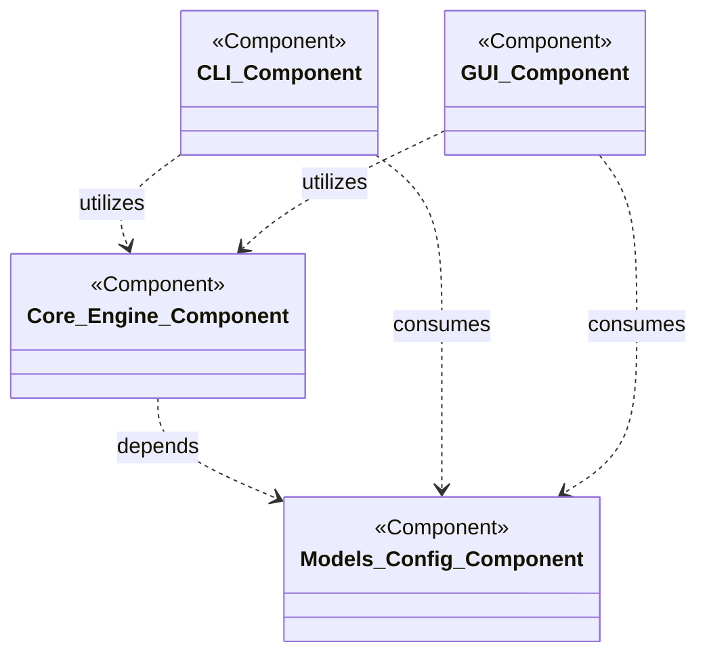
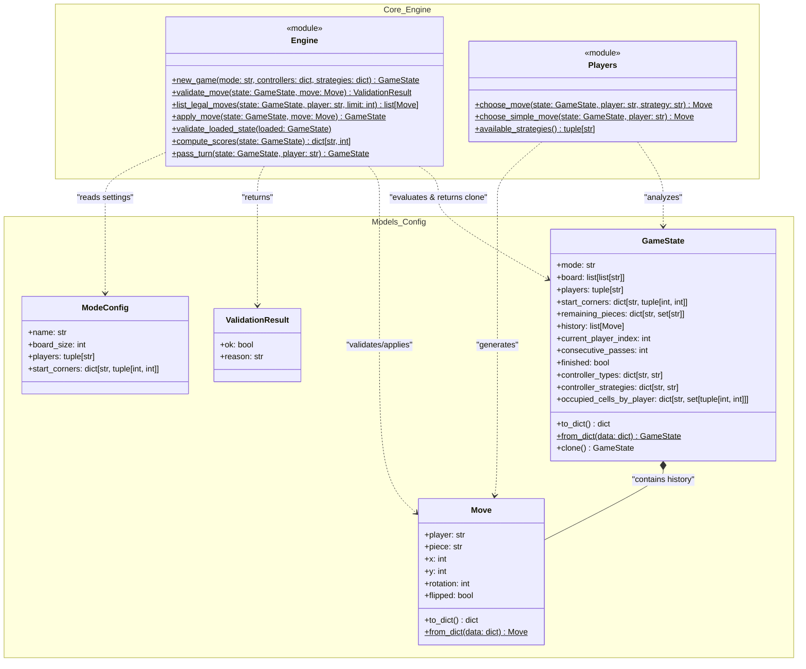
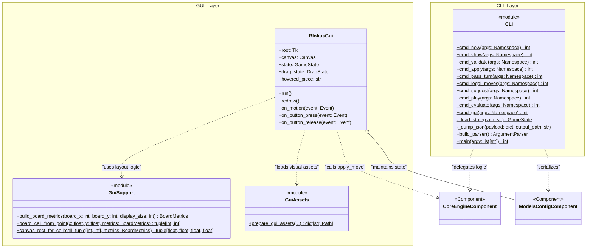

```mermaid
classDiagram
    %% Diagram 1: System Level Component Interactions
    class Models_Config_Component {
        <<Component>>
    }
    class Core_Engine_Component {
        <<Component>>
    }
    class CLI_Component {
        <<Component>>
    }
    class GUI_Component {
        <<Component>>
    }

    Core_Engine_Component ..> Models_Config_Component : depends
    CLI_Component ..> Core_Engine_Component : utilizes
    CLI_Component ..> Models_Config_Component : consumes
    GUI_Component ..> Core_Engine_Component : utilizes
    GUI_Component ..> Models_Config_Component : consumes
```

```mermaid
classDiagram
    %% Diagram 2: Models, Config & Core Engine Architecture
    namespace Models_Config {
        class GameState {
            +mode: str
            +board: list[list[str]]
            +players: tuple[str]
            +start_corners: dict[str, tuple[int, int]]
            +remaining_pieces: dict[str, set[str]]
            +history: list[Move]
            +current_player_index: int
            +consecutive_passes: int
            +finished: bool
            +controller_types: dict[str, str]
            +controller_strategies: dict[str, str]
            +occupied_cells_by_player: dict[str, set[tuple[int, int]]]
            +to_dict() dict
            +from_dict(data: dict) GameState$
            +clone() GameState
        }
        class Move {
            +player: str
            +piece: str
            +x: int
            +y: int
            +rotation: int
            +flipped: bool
            +to_dict() dict
            +from_dict(data: dict) Move$
        }
        class ValidationResult {
            +ok: bool
            +reason: str
        }
        class ModeConfig {
            +name: str
            +board_size: int
            +players: tuple[str]
            +start_corners: dict[str, tuple[int, int]]
        }
    }

    namespace Core_Engine {
        class Engine {
            <<module>>
            +new_game(mode: str, controllers: dict, strategies: dict) GameState$
            +validate_move(state: GameState, move: Move) ValidationResult$
            +list_legal_moves(state: GameState, player: str, limit: int) list[Move]$
            +apply_move(state: GameState, move: Move) GameState$
            +validate_loaded_state(loaded: GameState)$
            +compute_scores(state: GameState) dict[str, int]$
            +pass_turn(state: GameState, player: str) GameState$
        }
        class Players {
            <<module>>
            +choose_move(state: GameState, player: str, strategy: str) Move$
            +choose_simple_move(state: GameState, player: str) Move$
            +available_strategies() tuple[str]$
        }
    }

    GameState *-- Move : "contains history"
    Engine ..> GameState : "evaluates & returns clone"
    Engine ..> Move : "validates/applies"
    Engine ..> ValidationResult : "returns"
    Engine ..> ModeConfig : "reads settings"
    Players ..> GameState : "analyzes"
    Players ..> Move : "generates"
```

```mermaid
classDiagram
    %% Diagram 3: Presentation Layer Architecture (CLI & GUI)
    namespace CLI_Layer {
        class CLI {
            <<module>>
            +cmd_new(args: Namespace) int$
            +cmd_show(args: Namespace) int$
            +cmd_validate(args: Namespace) int$
            +cmd_apply(args: Namespace) int$
            +cmd_pass_turn(args: Namespace) int$
            +cmd_legal_moves(args: Namespace) int$
            +cmd_suggest(args: Namespace) int$
            +cmd_play(args: Namespace) int$
            +cmd_evaluate(args: Namespace) int$
            +cmd_gui(args: Namespace) int$
            -_load_state(path: str) GameState$
            -_dump_json(payload: dict, output_path: str)$
            +build_parser() ArgumentParser$
            +main(argv: list[str]) int$
        }
    }

    namespace GUI_Layer {
        class BlokusGui {
            +root: Tk
            +canvas: Canvas
            +state: GameState
            +drag_state: DragState
            +hovered_piece: str
            +run()
            +redraw()
            +on_motion(event: Event)
            +on_button_press(event: Event)
            +on_button_release(event: Event)
        }
        class GuiSupport {
            <<module>>
            +build_board_metrics(board_x: int, board_y: int, display_size: int) BoardMetrics$
            +board_cell_from_point(x: float, y: float, metrics: BoardMetrics) tuple[int, int]$
            +canvas_rect_for_cell(cell: tuple[int, int], metrics: BoardMetrics) tuple[float, float, float, float]$
        }
        class GuiAssets {
            <<module>>
            +prepare_gui_assets(...) dict[str, Path]$
        }
    }

    class CoreEngineComponent {
        <<Component>>
    }
    class ModelsConfigComponent {
        <<Component>>
    }

    CLI ..> CoreEngineComponent : "delegates logic"
    CLI ..> ModelsConfigComponent : "serializes"
    BlokusGui o-- ModelsConfigComponent : "maintains state"
    BlokusGui ..> CoreEngineComponent : "calls apply_move"
    BlokusGui ..> GuiSupport : "uses layout logic"
    BlokusGui ..> GuiAssets : "loads visual assets"
```
