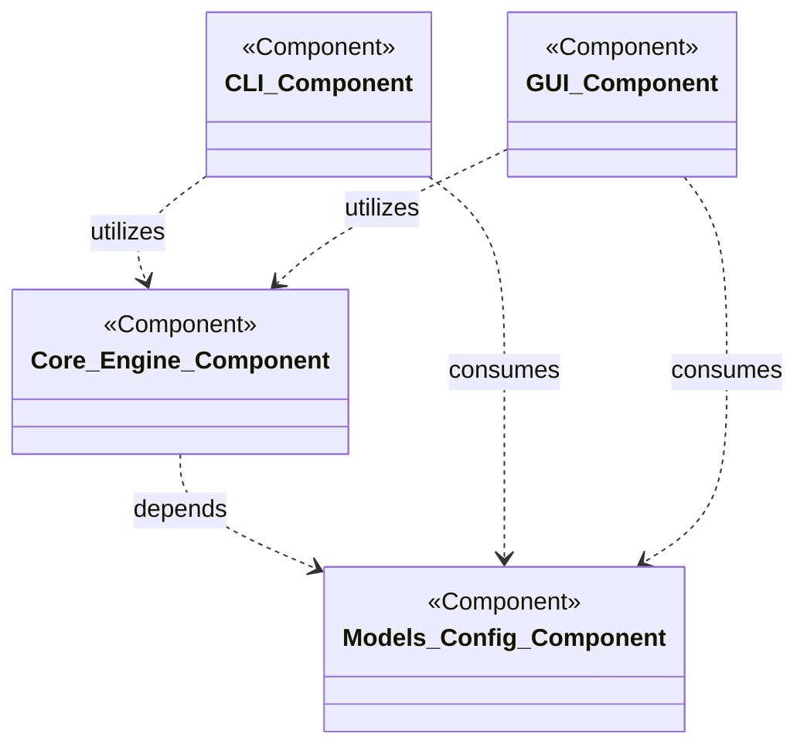
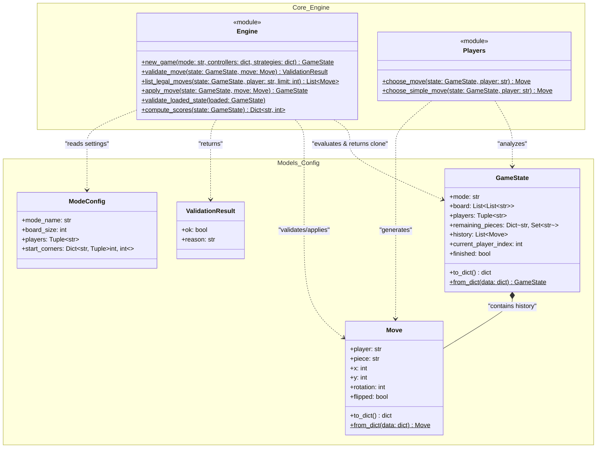
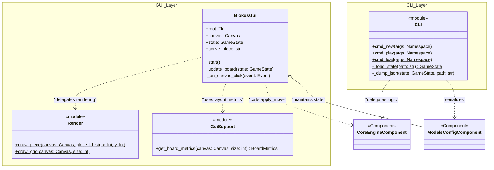

# Prompt:
Model: Gemini 3.1 Pro (High)
You are Andrej, an expert software engineer with 10 years of experience in software engineering, specialized in UML diagram generation and analysis.

Your new project is to generate 3 component diagrams for the Blokus game engine.
The component diagrams should focus on the game and the engine itself, not on the agentic review tools.Three scenarios for which you will create component diagrams are provided below. 
Use Mermaid UML. Use the syntax that is supported by Mermaid LiveEditor.

Architecture and Design is already selected and implemented. You need to understand the codebase and create component diagrams. 

Follow these steps:
1. extract entities from code → define relationships → format output → validate
2. For behavioral features, use a two-step pipeline: generate the static model first

Output strictly in valid MermaidLLM code. Resulting component diagram follow the latest mermaid specifications, and be renderable in Mermaid LiveEditor!! Conversational text outside code blocks is forbidden. Use concrete data types (no `<Type>` placeholders), visibility markers (`+`, `#`, `-`), and valid arrow syntax and advanced constructs (e.g. enumerations) 

You will 
- No dual representations (e.g., both an Enumeration and subclasses for the same type).
- No modeling of temporary method parameters as structural associations.

The system is divided into four primary logical components:

1. **Models & Config Component** (`models.py`, `config.py`, `pieces.py`)
   - Defines the core data structures (`GameState`, `Move`) and game constraints.
   - Has NO outgoing dependencies.

2. **Core Engine Component** (`engine.py`, `players.py`)
   - Functional module containing the rules, move validation, and AI logic.
   - Depends strictly on the Models & Config component.

3. **CLI Component** (`cli.py`)
   - Handles terminal execution, JSON state import/export, and headless play.
   - Depends on Engine and Models.

4. **GUI Component** (`gui.py`, `gui_support.py`, `gui_assets.py`, `render.py`)
   - Handles the Tkinter visual client, user interactions, and visual layout.
   - Depends on Engine and Models.

*Excluded:* `review/*`, `evaluate.py`, and `automation.py` should be excluded to focus strictly on the playable game architecture.

Put the resulting evaluation file under: /Users/maximilianalpgruder/Desktop/UNIMA FSS26/Gen_AI/projects/blokus/UML_new/Component

# Response:
Viewed comp_dia_prompt.md
Listed directory Component
Viewed prep.md:1-81
Viewed seq_dia_prompt.md:1-47
Listed directory blokus
Viewed models.py:1-235
Viewed engine.py:1-406
Edited blokus_component_diagrams.md

