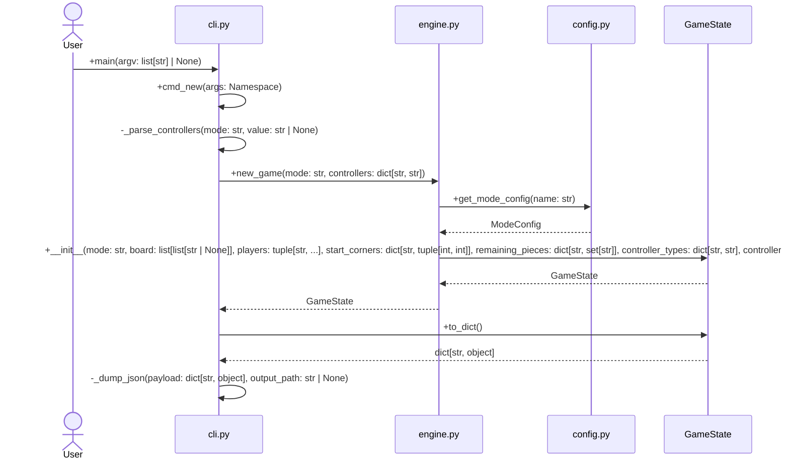
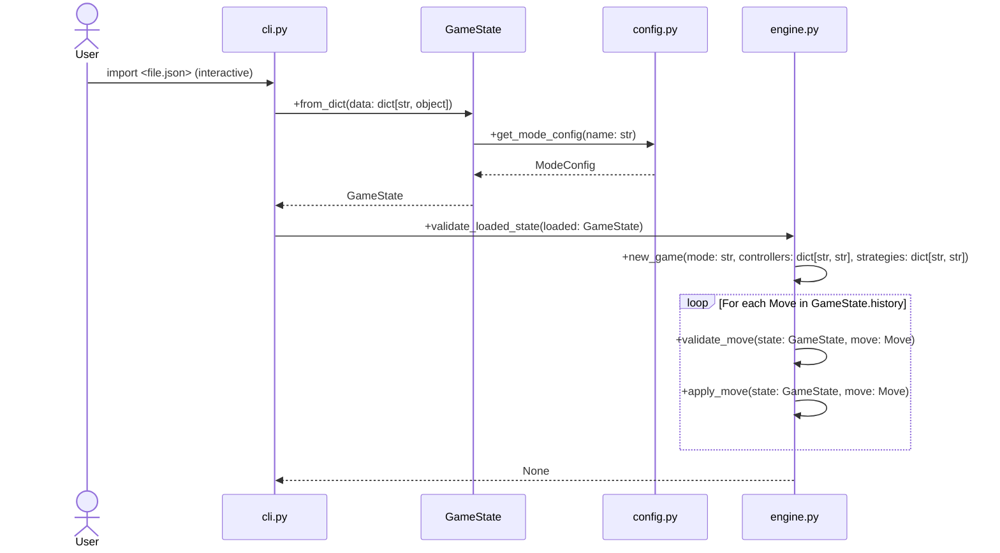
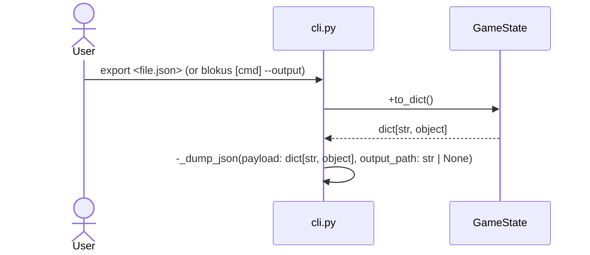

```mermaid
sequenceDiagram
    actor User
    participant CLI as cli.py
    participant Engine as engine.py
    participant Config as config.py
    participant State as GameState

    User->>CLI: +main(argv: list[str] | None)
    CLI->>CLI: +cmd_new(args: Namespace)
    CLI->>CLI: -_parse_controllers(mode: str, value: str | None)
    CLI->>Engine: +new_game(mode: str, controllers: dict[str, str])
    Engine->>Config: +get_mode_config(name: str)
    Config-->>Engine: ModeConfig
    Engine->>State: +__init__(mode: str, board: list[list[str | None]], players: tuple[str, ...], start_corners: dict[str, tuple[int, int]], remaining_pieces: dict[str, set[str]], controller_types: dict[str, str], controller_strategies: dict[str, str], occupied_cells_by_player: dict[str, set[tuple[int, int]]])
    State-->>Engine: GameState
    Engine-->>CLI: GameState
    CLI->>State: +to_dict()
    State-->>CLI: dict[str, object]
    CLI->>CLI: -_dump_json(payload: dict[str, object], output_path: str | None)

```

```mermaid
sequenceDiagram
    actor User
    participant CLI as cli.py
    participant State as GameState
    participant Config as config.py
    participant Engine as engine.py

    User->>CLI: import <file.json> (interactive)
    CLI->>State: +from_dict(data: dict[str, object])
    State->>Config: +get_mode_config(name: str)
    Config-->>State: ModeConfig
    State-->>CLI: GameState
    CLI->>Engine: +validate_loaded_state(loaded: GameState)
    Engine->>Engine: +new_game(mode: str, controllers: dict[str, str], strategies: dict[str, str])
    loop For each Move in GameState.history
        Engine->>Engine: +validate_move(state: GameState, move: Move)
        Engine->>Engine: +apply_move(state: GameState, move: Move)
    end
    Engine-->>CLI: None

```

```mermaid
sequenceDiagram
    actor User
    participant CLI as cli.py
    participant State as GameState

    User->>CLI: export <file.json> (or blokus [cmd] --output)
    CLI->>State: +to_dict()
    State-->>CLI: dict[str, object]
    CLI->>CLI: -_dump_json(payload: dict[str, object], output_path: str | None)
```
