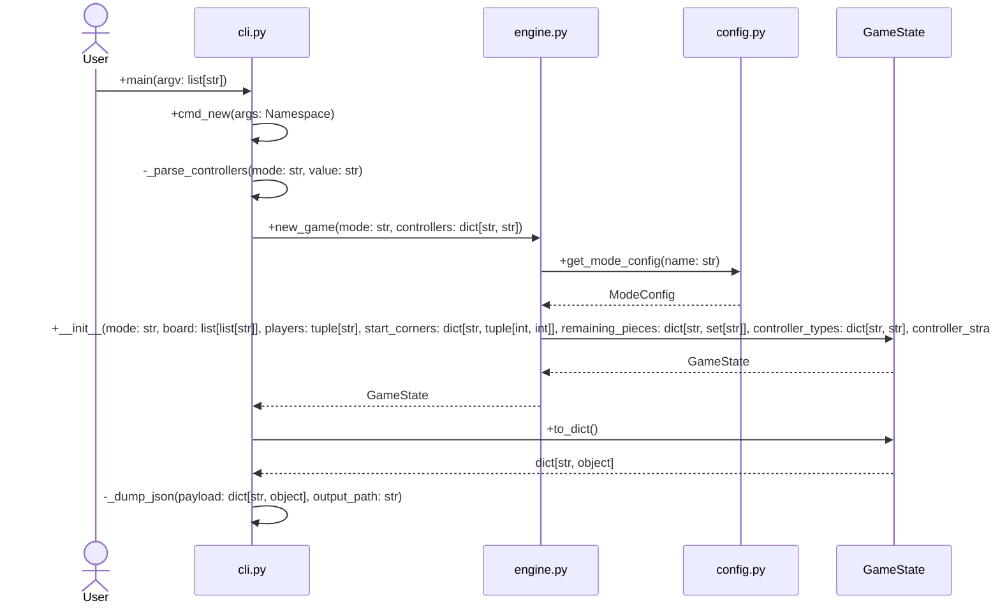
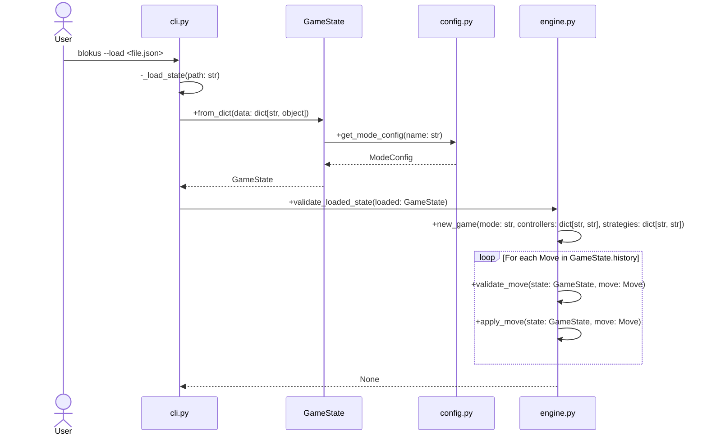
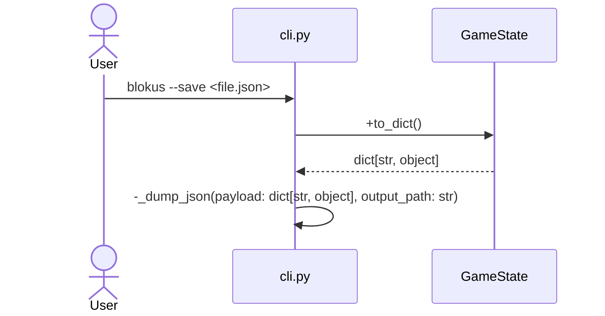

# Prompt:
Model: Gemini 3.1 Pro (High)
You are Andrej, an expert software engineer with 10 years of experience in software engineering, specialized in UML diagram generation and analysis.

Your new project is to generate 3 sequence diagrams for the Blokus game engine.
The sequence Diagram should focus on the game and the engine itself, not on the agentic review tools.Three scenarios for which you will create sequence diagramsn are provided below. 
Use Mermaid UML. Use the syntax that is supported by Mermaid LiveEditor.

Architecture and Design is already selected and implemented. You need to understand the codebase and create a sequence diagram. 

Follow these steps:
1. extract entities from code → define relationships → format output → validate
2. For behavioral features, use a two-step pipeline: generate the static model first

Output strictly in valid MermaidLLM code. Resulting sequence diagram must be renderable in Mermaid LiveEditor!! Conversational text outside code blocks is forbidden. Use concrete data types (no `<Type>` placeholders), visibility markers (`+`, `#`, `-`), and valid arrow syntax and advanced constructs (e.g. enumerations) 

You will 
- No dual representations (e.g., both an Enumeration and subclasses for the same type).
- No modeling of temporary method parameters as structural associations.

### Scenarios:

Game Initialization Flow (cli.py):
1. User runs `blokus new --mode classic` or `blokus play` in the terminal.
2. CLI parses arguments and delegates to `cli.cmd_new()` (or `cmd_play`).
3. CLI calls `engine.new_game(mode, controllers)`.
4. Engine calls `config.get_mode_config(mode)` to fetch the board size and players.
5. Engine initializes and returns a fresh `GameState` object.
6. CLI optionally serializes it to disk via `_dump_json()` or renders it to the terminal.

Import Game Flow (cli.py):
1. User runs blokus --load <file.json> ...
2. cli._load_state() opens the file and parses the JSON.
3. Calls GameState.from_dict(data) to rebuild the structural state.
4. Calls engine.validate_loaded_state(loaded_state) to ensure the imported JSON isn't corrupted or mathematically impossible (e.g., verifying piece counts against the board).

Export Game Flow (cli.py):
1. User runs blokus --save <file.json> or blokus export <file.json>.
2. CLI calls GameState.to_dict() to serialize the current game memory.
3. cli._dump_json() writes it to the disk.

Put the resulting evaluation file under: /Users/maximilianalpgruder/Desktop/UNIMA FSS26/Gen_AI/projects/blokus/UML_new/Sequence

# Response:
Ran command: `find "/Users/maximilianalpgruder/Desktop/UNIMA FSS26/Gen_AI/projects/blokus" -name "cli.py" -o -name "engine.py" -o -name "config.py" -o -name "state.py"`
Listed directory blokus
Viewed cli.py:1-466
Viewed models.py:1-235
Viewed engine.py:1-406
Viewed config.py:1-71
Ran command: `mkdir -p "/Users/maximilianalpgruder/Desktop/UNIMA FSS26/Gen_AI/projects/blokus/UML_new/Sequence"`
Edited blokus_sequence_diagrams.md

