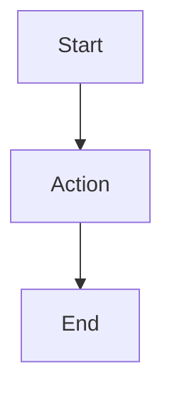

x# Topic-05_Guidelines.md

---

## Team Information

**Team Name:** `Design/5`  
**Topic:** `Design`  
**Date:** `25.03.2026`  
**Authors:** `Tobias Friedrich, Aleksander Kasak, Stephan Herbert`

---

## 1. Unified Guidelines

### Guideline 1: `Architecture Selection - ADR`

**Description:**

Use a chained multi-agent workflow for architecture selection only when the decision benefits from explicit decomposition into separate reasoning stages. The goal is not to add more agents, but to make the generation, comparison, and justification of architectural alternatives more inspectable. The workflow should therefore proceed from decision framing to option generation, explicit critique, and a final ADR-style decision record.

---

#### Stage 1 — Frame the Decision

1. **Use the workflow only for decisions with real architectural scope.**  
   Apply this guideline when the team is choosing between multiple plausible architecture options, balancing competing quality attributes, or making a decision that would be costly to reverse later. Do not use it for local implementation details or low-impact design choices.

2. **Define a small set of functionally distinct agent roles.**  
   A suitable chain may include:
   - Requirements / Context Analyst
   - Architecture Option Generator
   - Critic / Comparator
   - Decision Writer

   The roles should correspond to genuinely different tasks rather than superficial relabeling of the same activity.

3. **Assign one explicit output artifact to each role.**  
   Typical intermediate artifacts are:
   - extracted requirements, constraints, and assumptions
   - candidate architecture options
   - structured comparison and critique
   - final recommendation or ADR draft

   This keeps the reasoning process reviewable instead of hiding it inside a single response.

---

#### Stage 2 — Generate and Preserve Alternatives

1. **Derive architecture options from explicit decision drivers.**  
   Before generating solutions, identify the main drivers of the decision:
   - functional scope
   - constraints
   - quality goals
   - assumptions
   - explicit non-goals

   Candidate architectures should be grounded in these drivers rather than generic design preference.

2. **Generate multiple plausible architecture candidates.**  
   The option-generation stage should produce more than one defensible architecture for the same problem. Early convergence on a single proposal should be avoided.

3. **Keep at least two viable options alive until the critique is complete.**  
   This prevents the later evaluation stage from merely rationalizing an early favorite and ensures that real alternatives are being compared.

---

#### Stage 3 — Critique the Alternatives Explicitly

1. **Use a dedicated comparison stage to evaluate the candidate architectures.**  
   The comparison should be explicitly assessed:
   - trade-offs
   - assumptions
   - technical risks
   - likely change points
   - implications for relevant quality attributes

2. **Require the critique to be structured and reviewable.**  
   The output should not be a narrative preference statement. It should compare the alternatives against agreed criteria such as maintainability, extensibility, scalability, reliability, observability, migration cost, or reversibility.

3. **Treat critique as a challenge function, not as a summary function.**  
   The critic should identify weaknesses, hidden dependencies, and potential failure modes, including reasons why an apparently attractive option may still be unsuitable.

---

#### Stage 4 — Conclude with a Decision Record

1. **End the workflow with a formalized decision artifact.**  
    The final output should be an ADR-style result, for example:
    - one ADR per candidate option
    - one final ADR for the selected option
    - explicit rejected alternatives
    - concise rationale for the final recommendation

2. **Ensure that the final recommendation remains traceable to earlier stages.**  
    The final decision should consolidate the outputs of the requirements, generation, and critique stages rather than replace them. This keeps the rationale transparent and easier to defend later.

3. **Require human review before acceptance.**  
    The chained workflow should support architectural judgment, not replace it. Human review is necessary to detect propagated errors, missing assumptions, or unjustified conclusions introduced in earlier stages.

---

**Reasoning:**  
A chained multi-agent workflow is useful when architecture selection must be broken into distinct reasoning activities rather than handled as one monolithic prompt. In such cases, separating requirements interpretation, option generation, critique, and final documentation makes the process easier to inspect and improves the quality of the resulting decision record.

This is particularly valuable in design-oriented software engineering contexts, where the team must compare several plausible solutions and justify why one was selected over the others. By preserving intermediate artifacts, the workflow makes it easier to understand where assumptions entered the process, where trade-offs changed the ranking, and how the final ADR emerged.

For a Blokus engine, this makes the decision process more transparent and easier to communicate. Instead of asking for one preferred architecture immediately, the team can document how alternatives were derived, how they were challenged, and why one of them was ultimately selected.

**Example:**  

A suitable chained workflow for a Blokus engine could look as follows:

**Step 1 — Requirements / Context Analyst**  
Extract:

- core domain concepts
- invariants
- constraints
- quality goals
- explicit non-goals

**Step 2 — Architecture Option Generator**  
Propose three candidate architectures, for example:

- layered architecture
- hexagonal architecture
- plugin-oriented architecture

For each option, provide:

- major components
- responsibility allocation
- dependency direction
- extension points

**Step 3 — Critic / Comparator**  
Compare all options across agreed criteria such as:

- modularity
- maintainability
- extensibility
- scalability
- reliability
- observability
- migration cost
- risk of wrong choice

Then identify trade-offs, risks, and weaknesses for each candidate.

**Step 4 — Decision Writer**  
Produce:

- one ADR-style summary per option
- one final ADR for the selected option
- a short explanation of rejected alternatives

A simplified flow may be represented as:

User Requirements  
↓  
Requirements / Context Analyst  
↓  
Architecture Option Generator → Architecture A, B, C  
↓  
Critic / Comparator → trade-offs, risks, weaknesses  
↓  
Decision Writer → ADR and recommendation  
↓  
Final Architecture Decision

**When to Apply:**

- When there is more than one plausible architecture option.
- When the team must balance competing quality attributes.
- When the choice would be costly to reverse later.
- When intermediate artifacts such as critiques, diagrams, or ADR drafts are expected to be reused.
- When the team wants the reasoning process itself to be inspectable and discussable.

**When to Avoid:**

- When there is effectively only one realistic option.
- When the decision is narrow, local, and low-impact.
- When the workflow would introduce more procedural overhead than analytical value.
- When the team cannot yet state the criteria by which alternatives should be compared.
- When no human review of intermediate or final outputs is planned.

**Sources**

- Cai, Y., Li, R., Liang, P., Shahin, M., & Li, Z. (2025). *Designing LLM-based multi-agent systems for software engineering tasks: Quality attributes, design patterns, and rationale* [Preprint]. arXiv. <https://doi.org/10.48550/arXiv.2511.08475>
- Li, R., Zhang, Y., Zhou, X., Liang, P., Sun, W., Xuan, J., Jin, Z., & Liu, Y. (2025). *MAAD: Automate software architecture design through knowledge-driven multi-agent collaboration* [Preprint]. arXiv. <https://doi.org/10.48550/arXiv.2507.21382>
- Schmid, L., Hey, T., Armbruster, M., Corallo, S., Fuchß, D., Keim, J., Liu, H., & Koziolek, A. (2025). *Software architecture meets LLMs: A systematic literature review* [Preprint]. arXiv. <https://doi.org/10.48550/arXiv.2505.16697>
- Szczepanik, K., & Chudziak, J. A. (2025). *Collaborative LLM agents for C4 software architecture design automation* [Preprint]. arXiv. <https://doi.org/10.48550/arXiv.2510.22787>

---

### Guideline 2: `Design Selection - Refined ADR`

**Description:**  
Refine the high-level architecture with appropriate software design based on software patterns e.g. suggested by the Gang-of-Four design patterns. Input to the process is the ADR from guideline 1, and the final output is an enhanced/refined ADR.
The approach is again a phased process in which you:
**Phase 1 Preparation**

1. Define the `role` of the "requestor" e.g. as development architect or software designer
2. Define the `context` to be
   - the ADR (reviewed it for ambiguities – in beforehand)
   - the list of code qualities the solution shall contain (i.e., Extensibility, Maintainability, Modularity,
     Performance, Scalability, Security, Robustness)
   - company specific coding/pattern guidelines (if applicable)
3. Define the `task` to be for each high-level architecture approach
   - propose 3 solutions using various suitable patterns (e.g. GoF)
   - describe for each chosen pattern
     - which problem is solved by its usage?
     - what the rationale for choosing this pattern is?
     - interaction and flow between patterns
   - prioritization of a solution in regard to efficiency and effectiveness
4. Define the `output` to be
   - e.g. a json-format describing how to represent the different aspects of the solutions proposed
   - ensure it has a prioritization and overall complexity rating associated
**Phase 2 Human Review**
5. (Human) review of proposed solutions for misinterpretation, bias, cost, wrong assumptions
**Phase 3 Selection&Judgement**
6. Define `task`to be for
   - critically review and rate the complete combination of architecture and design
   - prioritize the overall solutions (matrix architecture / design)
   - rationalize the prioritization again in regard to code qualities, efficiency, and effectiveness
7. Define `output` to be
   - adjusted ADR document
8. Use another - ideally stronger - LLM with the `role` senior development achitect and `task` to evaluate the newly
   revised ADR for design flaws and improvement potentials. The `output` shall be a rationalized prioritized list of aspects that would need to be reviewd once more.

**Reasoning:**  
Literature indicates that LLMs are currently not very reliable on proposing software designs based on patterns due to the complexity certain patterns may incur. However, the problem can be mitigated by adding a human interaction in the loop. By setting the role, context, and explicit task descriptions, the likeliness of hallucinations can be reduced. Defining the expected output formats also guides the system and ensures that validation can be conducted efficiently.

*Helpful literature in formulating appropriate prompts*
See below in the raw section of guideline 2

*Gained insights during prompt experimentation*

- Reproducible outcome of software design generation based on patterns is tough and can only be achieved – if at
  all – if constraints are properly and clearly defined
- GoF patterns do not necessarily suit for UI design

**Example:**  
See the example from the demo.

**When to Apply:**
- With LLMs being likely to create reproducible designs only when bound closely by context and output format 
- Require (cost-effective) overview of possible alternatives 
- Avoid hallucinations 
- Complexity requires human interaction and reasoning/direction of models needs to be analyzable

**When to Avoid:**  
- Fully automated process is requested
- Design is per-se obvious or functional requirements are trivial
- No formal documentation of architecture rational requested


---

### Guideline 3: `UML Specification`

**Description:**

Generate UML diagrams using LLMs through a structured, phased workflow. The process has four stages: (1) prepare inputs, (2) apply core prompting principles, (3) follow diagram-type-specific guidance, and (4) validate outputs. Each stage builds on the previous one.

---

#### Stage 1 — Prepare Inputs

1. **Ensure requirements are clean and architecture is decided.**
   This guideline assumes that requirements have been pre-cleaned and architecture has been selected per Guidelines 1 and 2. Use the refined ADR output from Guideline 2 as the primary input for UML generation — architecture documentation produces better results than raw source code.
   *(Raw Guidelines: 3.L, 3.G, 3.T)*

2. **Choose notation by diagram type and delivery context.**
   Use mermaid or PlantUML as the preferred output format for UML Diagrams. Refer to the official Documentations for UML-Support. *(Raw Guidelines: 3.O, 3.B)*

   To reduce syntax errors, provide few-shot examples from the official Mermaid or PlantUML documentation in your prompt.
   *(Raw Guidelines: 3.2)*

3. **Start a fresh LLM session and keep context focused.**
   Use a new chat window for each domain or major revision — prior conversation history causes cross-contamination of domain concepts. Feed only the relevant architecture documentation and requirements into the session; excessive unrelated context adds complexity and degrades output quality.
   *(Raw Guideline: 3.C)*

---

#### Stage 2 — Core Prompting Principles

1. **Decompose — never generate a complete diagram in one prompt.**
   This is the single most important principle. Start with a maximum of eight core elements and expand iteratively. Break the modeling task into sequential reasoning steps: extract entities → define relationships → format output → validate. For behavioral features, use a two-step pipeline: generate the static model first, then inject operations in a second prompt. This last term is in accordance with our 6th guideline, as this two-step process was reported best for larger, reasoning-based models.
   *(Raw Guidelines: 3.A, 3.H, 3.J, 3.D)*

2. **Enforce notation and formatting explicitly.**
   Always specify the target syntax (e.g., "Output strictly in valid PlantUML code"). Forbid conversational text outside code blocks. Demand concrete data types (no `<Type>` placeholders), visibility markers (`+`, `#`, `-`), and valid arrow syntax. Explicitly request advanced constructs (e.g. enumerations) — the LLM will not use them unless told to.
   *(Raw Guidelines: 3.B, 3.E)*

3. **Apply negative constraints to prevent overdesign.**
   Explicitly tell the LLM what *not* to do:
   - No database tables, REST endpoints, or infrastructure in domain models.
   - No generic setters — use named state transitions (e.g., `activateAccount()` instead of `setStatus("active")`).
   - No dual representations (e.g., both an Enumeration and subclasses for the same type).
   - No modeling of temporary method parameters as structural associations.
   *(Raw Guidelines: 3.I, 3.E, 3.R)*

4. **Mandate traceability at three levels.**
   - *Element level:* Every diagram element traces to a Requirement ID via inline notes (e.g., This should be requested either within the diagram or in a separate specification document).
   - *Method level:* Every generated method carries an inline comment with Use Case ID and action description (e.g., `//UC02 //action: verify email format`).
   - *Repository level:* Store all diagrams as text-based code (Mermaid / PlantUML) in version-controlled documentation files, not as static images.
   *(Raw Guidelines: 3.M, 3.S, 3.AG)*

---

#### Stage 3 — Diagram-Type-Specific Guidance

**Class Diagrams:**

1. Use Chain-of-Thought (CoT) prompting: instruct the LLM to sequentially (a) extract entities and roles, (b) define attributes with concrete types, (c) decide inheritance and interfaces, (d) assign associations with multiplicities, and (e) sanity-check the syntax before outputting the final code.
   *(Raw Guideline: 3.D)*

2. Always provide Functional Requirements alongside the Domain Description. FRs supply the business logic that grounds associations between classes. Without them, the LLM produces isolated classes with poor relational mapping.
    *(Raw Guideline: 3.G)*

**Sequence Diagrams:**

1. Do not rely on the LLM to decide when to use `loop`, `alt`, or `opt` fragments. Explicitly instruct which actions are cyclic, which are conditional, and which are optional. Without this, the LLM either scatters actions randomly or creates unreadably deep nesting.
    *(Raw Guideline: 3.N)*

2. After generation, manually verify the initiating actor. LLMs have a strong bias toward user-triggered flows. Background processes, event-driven actions, and system-level tasks are frequently and incorrectly drawn as synchronous calls from a human user.
    *(Raw Guideline: 3.P)*

3. For every major message or alternative block, require a `note right` that states the corresponding Requirement ID. This prevents over-summarization and enables quick verification.
    *(Raw Guideline: 3.M)*

**Component Diagrams:**

1. Cap diagrams at approximately 15–20 components. Beyond that threshold, the PlantUML rendering engine produces unreadable "spaghetti" layouts with severe edge overlap. Split the system into subcomponent views (e.g., "Student Lifecycle," "Financial Flows") and combine them manually in draw.io or Visio.
    *(Raw Guideline: 3.1)*

---

#### Stage 4 — Validation (Post-Generation)

1. **Automated syntax check.** Render the output in the target tool (PlantUML Online Server, Mermaid Live Editor). Fix all syntax errors before proceeding to semantic review.

2. **LLM-as-Judge.** Open a fresh LLM session and provide a strict 1–5 scoring rubric covering: (1) Completeness — are all requirements represented? (2) Correctness — are relationships and multiplicities accurate? (3) Standards adherence — is the UML/PlantUML/Mermaid syntax valid? (4) Comprehensibility — is the diagram readable? (5) Terminological alignment — do names match the domain language? Limit the validator to finding missing elements and fixing relationship errors. Do not let it redesign the class hierarchy.
    *(Raw Guidelines: 3.F, 3.K)*

3. **Human architect review.** Final sign-off by a human, focusing on aspects LLMs consistently get wrong: initiating actors in sequence diagrams, abstraction-level mixing, business-logic completeness, and layout readability for large diagrams.
    *(Raw Guideline: 3.P, 3.I)* For Larger Component Diagrams, split the generation into several smaller diagrams and combine them manually using MS Visio or drawio to ensure readability, without sacrificing maintainability. *(Raw Guideline: 3.1)*

---

**Reasoning:**

UML diagrams serve as the primary communication artifact between architects, developers, and stakeholders. Errors in these diagrams propagate directly into implementation.
The exact reasonings for each step can be found in the raw guidelines below. Here is a quick overview:
LLMs are capable generators of UML code but have well-documented, recurring failure modes:

- They drop requirements in large single-shot prompts (Cámara et al., 2023; Nguyen et al., 2026).
- They hallucinate invalid syntax and relationships (Nguyen et al., 2026; He et al., 2026).
- They default to user-triggered flows even for system events (Cervantes et al., 2025).
- They fail to use advanced UML constructs unless explicitly instructed (Cámara et al., 2023).
- Rendering engines cannot produce readable layouts beyond ~20 connected components (LLM Experimentation, Guideline 3.1).

These failure modes are predictable and addressable through structured prompting. The four-stages provided above systematically address each one.

The LLM-as-Judge validation step (Stage 4) is supported by Nguyen et al. (2026), who found that LLM judgments closely align with human evaluations on structural diagram quality, making them effective as preliminary assessors that reduce the review burden on human architects.

---

**References:**
See Raw Guidelines below.

**Example:**

*Generating a class diagram for an Order Management system:*

**Step 1 — Ensure inputs are ready (per Guidelines 1 and 2) and start a fresh session.**

```
Functional Requirements:
- FR1: A Customer places an Order.
- FR2: Each Order contains one or more OrderItems.
- FR3: Each OrderItem references exactly one Product.
- FR4: An Order transitions through statuses: PENDING → CONFIRMED → SHIPPED → DELIVERED.
- FR5: A Customer can cancel a PENDING order.
```

**Step 2 — Prompt for static model (CoT, explicit notation, negative constraints):**

```
You are a senior software architect. Think step-by-step:
(a) Extract entities and roles from the requirements below.
(b) Define attributes with concrete types and visibility markers (+, -, #).
(c) Decide inheritance and interfaces.
(d) Assign associations with multiplicities and labels.
(e) Sanity-check the Mermaid syntax.

Then output ONLY valid Mermaid class diagram code.

Constraints:
- Use concrete types only (no <Type> placeholders).
- Do NOT include database tables, REST endpoints, or UI elements.
- Do NOT use generic setters. Model status transitions as named methods
  (e.g., confirmOrder(), not setStatus()).
- Use an Enumeration for OrderStatus. Do NOT also create subclasses for
  the same statuses.

Requirements:
[paste FR1–FR5 here]
```

**Step 3 — Prompt for operations (second pass):**

```
Given this class diagram:
[paste generated Mermaid code]

And these Functional Requirements:
[paste FR1–FR5]

Add the core business operations to each class. Rules:
- 1 method = 1 atomic business action. Split at "and" clauses.
- Tag each method: // FR-XX // action: [description]
- No UI or persistence methods (no save(), display(), render()).

Output ONLY the updated Mermaid code.
```

**Step 4 — Validate with LLM-as-Judge (fresh session):**

```
You are a strict UML evaluator. Score this class diagram against the
requirements using integers 1–5:

1. Completeness: Are all requirements represented?
2. Correctness: Are relationships and multiplicities accurate?
3. Standards Adherence: Is the Mermaid syntax valid?
4. Comprehensibility: Is the diagram readable?
5. Terminological Alignment: Do names match the domain?

Requirements: [paste FR1–FR5]
Diagram: [paste Mermaid code]

If any score is below 4, output the corrected Mermaid code.
```

---

**When to Apply:**

- After requirements are finalized, and architecture is selected (i.e., after Guidelines 1 and 2 are complete).
- When the system has enough complexity to benefit from formal modeling (roughly 4+ interacting classes or 3+ distinct actors).
- When the team uses a Markdown-centric documentation workflow where diagrams-as-code can be version-controlled alongside source code.

**When to Avoid:**

- Throwaway prototypes or spikes where formal modeling adds overhead without return.
- Trivially small systems (fewer than 3–4 classes) — write the code directly.
- Highly volatile requirements that have not yet stabilized — model too early, and you will redo it repeatedly.
- When the rendering target demands pixel-precise layout (e.g., client-facing slide decks) — use a graphical tool instead and treat the LLM-generated code as a starting draft.
- When the architecture reaches a certain amount of complexity.

---

### Guideline 4: `Architecture / Design Validation - Decision`

**Description:**

Validate the selected architecture by systematically reviewing the documented decision, its rationale, and its technical implications. The goal is not to generate a new architecture, but to assess whether the selected decision remains justified when checked against its decision basis, relevant quality attributes, realistic architecture scenarios, and possible inconsistencies or violations (Schmid et al., 2025; Su et al., 2026; Zhou et al., 2025). The validation process should therefore proceed from decision-basis review to scenario-based validation and conclude with human review (Cervantes et al., 2026; Su et al., 2026).

---

#### Stage 1 — Validate the Decision Basis

1. **Use the selected ADR and its documented rationale as the primary validation input.**  
   Validation should begin with the recorded decision artifact rather than with a regenerated or shortened summary. The review should focus on the actual rationale that is intended to justify and constrain the architecture (Su et al., 2026; Zhou et al., 2025).

2. **Check whether the rationale is explicit enough to support validation.**  
   Review whether the decision makes its assumptions, constraints, trade-offs, and expected consequences sufficiently visible for later assessment. Validation is limited when these elements remain implicit or incomplete (Zhou et al., 2025).

3. **Verify that the selected architecture still reflects the original architecture drivers.**  
   Check whether the chosen option still addresses the relevant quality goals, functional concerns, and constraints that motivated the decision. The architecture should remain traceable to these drivers (Cervantes et al., 2026; Schmid et al., 2025).

---

#### Stage 2 — Validate with Quality-Attribute Scenarios

1. **Formulate validation questions as self-contained architecture scenarios.**  
   Each scenario should be concrete, specific, and as unambiguous as possible. Where appropriate, use explicit conditions, expected responses, or measurable criteria (Cervantes et al., 2026).

2. **Focus the validation on the quality attributes that matter for the system.**  
   The scenarios should reflect the project-specific qualities that motivated the decision, for example:
   - security
   - testability
   - scalability
   - observability
   - consistency
   - availability

   Validation should therefore be grounded in relevant architectural concerns rather than generic notions of design quality (Cervantes et al., 2026).

3. **Review the selected architecture against rejected alternatives through explicit trade-offs.**  
   Validation should not merely restate why the chosen option was selected. It should examine whether the documented pros, cons, and trade-offs remain convincing when compared with the rejected alternatives (Cervantes et al., 2026; Zhou et al., 2025).

4. **Use the validation step to detect possible decision inconsistencies or violations.**  
   Check whether the described or implemented architecture appears to drift away from the documented decision. This includes inconsistencies between the ADR, the architecture description, and the expected technical consequences of the choice (Schmid et al., 2025; Su et al., 2026).

---

#### Stage 3 — Conclude with Human Review

1. **Treat the LLM as an analytical assistant, not as the final authority.**  
   Use it to surface concerns, challenge assumptions, compare alternatives, and identify possible inconsistencies. The validation result should be treated as analytical support rather than as a final judgment (Cervantes et al., 2026; Zhou et al., 2025).

2. **Require final human review of the validation outcome.**  
   A human architect or developer should determine whether the identified trade-offs, possible violations, or review points are actually relevant in the project context. Final responsibility should remain with the team (Cervantes et al., 2026; Su et al., 2026).

---

**Reasoning:**  
Architecture validation should begin with the **documented decision itself**. Design rationale is a central architecture artifact, but LLM-generated rationale is not reliable enough to be accepted without review. Zhou et al. show that LLMs can generate useful arguments for software architecture decisions, yet their results remain only moderately accurate and can include misleading arguments. This supports using the ADR and its original rationale as the starting point for validation rather than relying on a regenerated summary (Zhou et al., 2025).

A scenario-based review is suitable because architecture decisions are usually made in response to **quality attributes, constraints, and functional concerns**. Cervantes et al. formulate architecture problems around qualities such as security, testability, scalability, observability, and consistency, using self-contained scenarios to surface assumptions and trade-offs. This supports validating architecture decisions through explicit quality-attribute scenarios instead of vague “good/bad architecture” judgments (Cervantes et al., 2026).

Validation should also revisit **rejected alternatives and possible decision violations**. Cervantes et al. show that LLMs can compare alternatives, but that human architects often disagree with the suggestions because the models lack context and can be inconsistent in trade-off analysis. Su et al. further shows that LLMs can help detect ADR-related inconsistencies, especially for explicit and code-inferable decisions, while remaining weaker for implicit and context-dependent ones. Together with the systematic review by Schmid et al., which identifies architecture conformance checking as underexplored, this supports a validation process that uses LLMs as analytical assistants while keeping final judgment under human control (Cervantes et al., 2026; Schmid et al., 2025; Su et al., 2026).

---

**Example:**  

A suitable validation workflow for a selected architecture could look as follows:

**Step 1 — Decision Basis Review**  
Review:

- selected ADR
- architecture description
- architecture drivers

Check whether:

- assumptions are explicit
- trade-offs are visible
- consequences are documented
- the decision still fits the original drivers

**Step 2 — Quality-Attribute Scenario Review**  
Formulate validation scenarios for the selected architecture, for example:

- How does the architecture behave under a scalability-related load increase?
- How does the design support observability during failure analysis?
- How does the architecture preserve consistency across concurrent operations?

**Step 3 — Trade-off Review**  
Compare the selected option with rejected alternatives using:

- pros
- cons
- trade-offs
- unresolved risks

Check whether the original comparison still appears justified.

**Step 4 — Decision Violation Review**  
Identify whether:

- the described architecture deviates from the ADR
- architectural constraints are being violated
- the implementation direction conflicts with the selected decision

**Step 5 — Human Review**  
Summarize:

- what appears valid
- what is questionable
- what may indicate a decision violation
- what requires human follow-up

A simplified flow may be represented as:

Selected ADR and Architecture Description  
↓  
Decision Basis Review  
↓  
Quality-Attribute Scenario Review  
↓  
Trade-off Review Against Alternatives  
↓  
Possible Decision Violation Review  
↓  
Human Review and Final Judgment

---

**When to Apply:**

- When one architecture option has already been selected or clearly prioritized
- When the decision is documented in an ADR or equivalent artifact
- When the architecture must be reviewed against specific quality attributes
- When the team wants to assess whether the documented rationale is still convincing
- When the team wants to detect possible inconsistencies between decision and architecture

**When to Avoid:**

- When no actual architecture decision has been documented yet
- When the rationale is too incomplete to support meaningful review
- When validation would rely only on vague “good” or “bad” architecture judgments
- When no relevant quality attributes or scenarios can be stated
- When the team expects the LLM to replace final human architectural judgment

---

**Sources**

- Cervantes, H., Cai, Y., & Kazman, R. (2026). *LLMs as Assistants in Software Architecture Design*. *IEEE Software*, 1–9. <https://doi.org/10.1109/MS.2026.3663353>
- Schmid, L., Hey, T., Armbruster, M., Corallo, S., Fuchß, D., Keim, J., Liu, H., & Koziolek, A. (2025). *Software Architecture Meets LLMs: A Systematic Literature Review*. *CoRR*, abs/2505.16697. <https://doi.org/10.48550/arXiv.2505.16697>
- Su, R., Bakhtin, A., Ahmad, N., Esposito, M., Lenarduzzi, V., & Taibi, D. (2026). *Evaluating Large Language Models for Detecting Architectural Decision Violations*. *CoRR*, abs/2602.07609. <https://arxiv.org/abs/2602.07609>
- Zhou, X., Li, R., Liang, P., Zhang, B., Shahin, M., Li, Z., & Yang, C. (2025). *Using LLMs in Generating Design Rationale for Software Architecture Decisions*. *CoRR*, abs/2504.20781. <https://doi.org/10.48550/arXiv.2504.20781>

---

### Guideline 5: `Backend-Frontend Separation and UI/UX Design`

**Description:**

Design backend and frontend independently. When prompting LLMs for frontend work, treat user experience as a first-class requirement — LLMs might not consider it unless explicitly asked. Iterate visually with the human as Creative Director.

---

1. **Separate backend and frontend design.**
   Run the architecture and design process (Guidelines 1–4) for the backend first. Then run an equivalent process for the frontend as a standalone effort. The two converge at the API contract defined by the backend's UML interfaces. Frontend design should be *informed by* but not *subordinate to* backend architecture — products in the consumer space are bought for their look and feel, not their backend elegance. Decoupling also protects against unnecessary churn: frontend fashions (frameworks, visual trends, UI languages) change faster than backend capabilities.
   *(Raw Guidelines: 5.1)*

2. **Define a frontend-specific role and design identity before prompting.**
   Assign the LLM a specialized persona (e.g., "UX Architect" from <https://github.com/msitarzewski/agency-agents>) with explicit constraints and quality attributes. For serious design efforts, use detailed persona definitions that enforce structured deliverables — (interaction flows, accessibility requirements) — as the LLM will probably not proactively generate these. Use negative prompts to block generic defaults: explicitly forbid standard Bootstrap spacing, default sans-serif fonts, generic card layouts, or whatever conflicts with the target brand identity. Moreover, instruct the LLM to ask clarifying questions before it produces the next prototype - this allows identifying and challenging uncertainties right away.
   *(Raw Guidelines: 5.B, 5.AG, 5.C)*

3. **Prompt for user experience explicitly.**
   LLMs optimize for functional correctness. They satisfy rules and requirements but ignore whether a human can actually operate the result. After the functional implementation works, add a dedicated prompt that asks the LLM to *reflect on the current interaction workflow from the user's perspective* and redesign it for usability. Specifically request: What does the user see at each step? What information do they need to make a decision? What actions are available and how are they discovered? Also, explicitly ask (if needed) for accessibility features (keyboard navigation, screen reader support, contrast ratios) — the LLM might skip both unless told.
   *(Raw Guidelines: 5.2, 5.AG)*

4. **Iterate visually — AI drafts fast, human directs with specific feedback.**
   Use AI ((vibe) coding agents, Figma Make, Google Stitch, or similar tools) to generate a first draft quickly. Do not start from a blank screen. Then review each output visually and give short, directed feedback to refine the result. The human acts as Creative Director: the AI provides layout, component scaffolding, and boilerplate; the human owns brand identity, aesthetic personality, and the details that make the application feel alive. When natural language fails to describe a visual fix, use multimodal prompting — upload a screenshot of the current state alongside a rough sketch of the desired state.
   *(Raw Guidelines: 5.A, 5.BG, 5.C)*

---

**Reasoning:**

Frontend development with LLM assistance faces a different challenge than backend architecture (Guidelines 1–4). Backend work is primarily structural and logical — the LLM can reason about patterns, relationships, and constraints effectively. Frontend work adds an aesthetic and experiential/creative dimension that LLMs can fail to address on their own (for now).

The evidence for this gap comes from the raw guidelines defined below:

- In our experimentation (Guideline 5.2), GPT-Codex-5.3 produced a functionally correct Blokus implementation in two prompts — but the game was unplayable because the agent never considered that players need to *see* their pieces, *preview* orientations, and *discover* valid moves. One follow-up prompt asking for UX reflection fixed this rapidly, confirming that the capability exists but the initiative does not.
- From literature, Sapkota et al. (2025) (Guideline 5.A) establish that UI/UX work requires "intuitive, human-in-the-loop interaction" where the developer acts as Creative Director — autonomous agents lack the aesthetic judgment needed for this task.
- When we experimented with Google Stitch, we were able to generate a modern, intuitive Blocus user interface in just one three-worded prompt. Using these tools can save a lot of time and let the user focus on creativity rather than syntax.

---

**Example:**

*Given: The Order Management backend from Guideline 3 exposes these API endpoints:*

```
GET  /customers/{id}/orders       → list orders with status
POST /orders                      → place new order
POST /orders/{id}/confirm         → confirm pending order
POST /orders/{id}/cancel          → cancel pending order
```

**Step 1 — Define role and constraints:**

```
You are a Senior UI/UX Architect specializing in e-commerce interfaces.

Technical constraints:
- React with Tailwind CSS
- Must consume the REST API defined above
- Mobile-first responsive design
- WCAG 2.1 AA accessibility compliance

Design constraints:
- Do NOT use default Tailwind color palette — use the brand colors: #1A2B4A (navy), #F4A261 (amber), #E9ECEF (light grey).
- Do NOT use generic card layouts for the order list.
- Do NOT use standard sans-serif — use Inter for body, Playfair Display for headings.

Suggest a frontend architecture approach for this order management interface.
Prioritize by: ease of implementation, user experience quality, and maintainability.
Rationalize each suggestion.
```

**Step 2 — Prompt explicitly for UX after functional scaffolding:**

```
The order management UI is now functional — customers can view, place,
confirm, and cancel orders. But I have not considered the user experience.

Reflect on the current interaction workflow from the customer's perspective:
- What does the customer see when they open the order page?
- How do they discover they can cancel a pending order?
- How is order status communicated visually (not just as text)?
- What happens when an action fails (e.g., canceling an already-shipped order)?
- Is the interface navigable by keyboard and screen reader?

Redesign the component structure to address these questions.
Output updated React/Tailwind code.
```

**Step 3 — Iterate visually:**

```
The order status badges look too similar — PENDING and CONFIRMED are
both grey-ish. Make PENDING amber (#F4A261) with a pulsing dot to
indicate it needs attention. Make CONFIRMED solid navy (#1A2B4A).
Also, the cancel button is too easy to hit accidentally — add a
confirmation step.
```

---

**When to Apply:**

- When the product has a user-facing frontend (web, mobile, CLI with interactive flows).
- After the backend architecture and API contract are defined (i.e., after Guidelines 1–3).
- When the team wants to use LLMs for frontend code generation or UI prototyping.
- When rapid visual iteration is more valuable than pixel-perfect upfront specification.

**When to Avoid:**

- Purely backend or API-only services with no user-facing interface.
- When the frontend is a pre-existing platform or design system that cannot be changed (e.g., embedding into an existing enterprise portal or using e.g. the Power Platform).
- When strict brand guidelines and pixel-perfect mockups already exist from a dedicated design team — in this case, the LLM's role is implementation.
- CLI tools with trivial interaction (single input, single output) where UX concerns are minimal.

### Guideline 6: `SOTA Models`

**Description:**  

1. When choosing your LLM for the architecture phase (but also beyond), benchmarks indicate that current LLMs - latest version as of February 2026, irrespective of whether proprietary of open source, are the tool of choice. Their performance is significantly higher in almost all dimensions. (on February 2026 Claude Sonnet 4.5/4.6, Claude Opus 4.5/4.6, GPT-5.2/4, Gemini 3 (Pro), MiniMax M2.5 or GLM-5 or equivalent)
**Reasoning:**  
With the increasing performance of LLMs and the increasing capabilities in their reasoning the proposals of LLMs on Software Architecture and Design can be better evaluated, both by humans and LLMs-as-judge. However, it will need to be checked over time whether the progress - so far doubling the capabilities every 7 months - can be maintained or whether a certain version of LLMs becomes `good enough`. With proprietary LLMs incurring cost, the final choice of a model may at present still depend on the available budget but cost drops quickly even so the cost for comparable performance halfpences every year.
**Example:**  
n.A.
**When to Apply:**  
As long as LLMs progress in benchmarks with doubling performance every seven months, this guideline shall be applied
**When to Avoid:**  
When budget constraints dictate the choice of an elder model. When dialing with sensitive data, the latest open-source models would be advisable

---

## 2. Raw Guidelines (Source Documents)

### 2.1 Guidelines from Literature Readings

**For Guideline 1 (Architecture Selection – ADR)**

**Readings Assigned**

- `Cai, Y., Li, R., Liang, P., Shahin, M., & Li, Z. (2025). Designing LLM-based multi-agent systems for software engineering tasks: Quality attributes, design patterns, and rationale. arXiv preprint arXiv:2511.08475. https://doi.org/10.48550/arXiv.2511.08475`
- `Li, R., Zhang, Y., Zhou, X., Liang, P., Sun, W., Xuan, J., Jin, Z., & Liu, Y. (2025). MAAD: Automate software architecture design through knowledge-driven multi-agent collaboration. arXiv preprint arXiv:2507.21382. https://doi.org/10.48550/arXiv.2507.21382`
- `Schmid, L., Hey, T., Armbruster, M., Corallo, S., Fuchs, D., Keim, J., Liu, H., & Koziolek, A. (2025). Software architecture meets LLMs: A systematic literature review. arXiv preprint arXiv:2505.16697. https://doi.org/10.48550/arXiv.2505.16697`
- `Szczepanik, K., & Chudziak, J. A. (2025). Collaborative LLM agents for C4 software architecture design automation. arXiv preprint arXiv:2510.22787. https://doi.org/10.48550/arXiv.2510.22787`

**Extracted Guidelines:**

**Guideline 1.A: Decompose architecture selection into explicit roles and artifacts**  
**Source:** `Cai et al. (2025); Li et al. (2025)`  
**Description:** Do not let the LLM handle architecture selection in one go. Set up a staged workflow with distinct roles — context analyst, option generator, critic, decision writer — where each stage produces its own artifact. This keeps the reasoning inspectable and avoids hidden jumps.  
**Reasoning:** Both papers show role-based cooperation as the dominant pattern in LLM multi-agent SE systems. Li et al.'s MAAD uses four specialized agents that produce traceable artifacts at every stage. Cai et al. confirm that *"allocating specialized roles to agents facilitates independent development as well as targeted testing and updating of individual agents."* **Avoid:** Do not combine generation and critique in one prompt — it hides trade-offs.  
**Example:** Stage outputs: `requirements → drivers/constraints table → 3 architecture options → critique matrix → ADR draft`.

**Guideline 1.B: Preserve alternatives until critique is complete**  
**Source:** `Li et al. (2025); Szczepanik & Chudziak (2025)`  
**Description:** Always generate at least three plausible architecture candidates and keep all of them alive until the critique stage is done. Do not let the model pick a winner during generation.  
**Reasoning:** Early convergence leads to anchoring — the model rationalizes its first idea instead of genuinely exploring. Li et al. found that MAAD's multi-agent setup *"substantially outperforms MetaGPT's single-agent setup"* because agents explored independently. Szczepanik & Chudziak similarly reset context between C4 levels to force fresh exploration. **Avoid:** Prompts like "pick the best architecture" collapse the exploration phase.  
**Example:** Keep `layered`, `hexagonal`, and `plugin-based` architectures alive through comparison. Only select after a structured quality-attribute critique.

**Guideline 1.C: End with an ADR that includes rejected alternatives**  
**Source:** `Schmid et al. (2025)`  
**Description:** Always finalize with a proper ADR that includes the selected option, rejected alternatives with reasons, the drivers, and expected consequences.  
**Reasoning:** Schmid et al.'s SLR identifies *"creating architecture decision records"* as a key LLM application scenario. Documenting rejected options prevents repeat discussions and helps future architects understand why something was ruled out. **Avoid:** Do not accept an ADR that only states the decision without alternatives.  
**Example:** ADR sections: `Context`, `Architecture Drivers`, `Decision`, `Alternatives Considered`, `Trade-offs`, `Consequences`.

**Guideline 1.D: Require human review before accepting the selected architecture**  
**Source:** `Schmid et al. (2025); Cai et al. (2025)`  
**Description:** Treat all LLM-generated architecture outputs as decision support. An architect must review and explicitly approve or reject the ADR before it is accepted.  
**Reasoning:** Schmid et al. found that assistant-type systems with human interaction produce more reliable results than fully automated ones. Cai et al. report that practitioners *"appreciated MAAD's ability to recall knowledge comprehensively, yet emphasized the continued need for human validation."* **Avoid:** Do not auto-accept LLM recommendations without human sign-off.  
**Example:** Human review gate: `approve`, `revise`, or `reject` the ADR. Final status stays under human ownership.

---

**For Guideline 2 (Design Selection - Refine ADR)**

**Readings Assigned**

- `Chen, Z., Wang, C., Sun, W., Liu, X., Zhang, J.M., Liu, Y. (2025). Promptware Engineering: Software Engineering for Prompt-Enabled Systems. arXiv preprint arXiv:2503.02400 https://doi.org/10.48550/arXiv.2503.02400`
- `Tian, H., Wang, C., Yang, B., Zhang, L., Liu, Y. (2025). A Taxonomy of Prompt Defects in LLM Systems. arXiv preprint arXiv:2509.14404. https://doi.org/10.48550/arXiv.2509.14404`
- `Li, Z., Sergeyuk, A., Izadi, M. (2025). Prompt-with-Me: in-IDE Structured Prompt Management for LLM-Driven Software Engineering. arXiv preprint arXiv:2509.17096. https://doi.org/10.48550/arXiv.2509.17096`
- `Díaz-Pace, J.A., Tommasel, A., Capilla, R. (2024). Helping Novice Architects to Make Quality Design Decisions Using an LLM-Based Assistant. In: Galster, M., Scandurra, P., Mikkonen, T., Oliveira Antonino, P., Nakagawa, E.Y., Navarro, E. (eds) Software Architecture. ECSA 2024. Lecture Notes in Computer Science, vol 14889. Springer, Cham. https://doi.org/10.1007/978-3-031-70797-1_21`
- `JMaranhão, João & Guerra, Eduardo. (2024). A Prompt Pattern Sequence Approach to Apply Generative AI in Assisting Software Architecture Decision-making. 1-12. 10.1145/3698322.3698324. https://doi.org/10.1145/3698322.3698324`
- `Dae-Kyoo Kim (2025). Comparative analysis of design pattern implementation validity in LLM-based code refactoring, Journal of Systems and Software, Volume 230. https://doi.org/10.1016/j.jss.2025.112519` *Note* This paper proposes a very interesting yet time-consuming approach to verify the implementation of design patterns using predicate logic. We found this to be out of scope for this code but chose to add it for completeness.

**Extracted Guidelines:**
**Guideline 2.A: Roles, Prechecking, and Output formatting**
**Source:**
`Chen, Z., Wang, C., Sun, W., Liu, X., Zhang, J.M., Liu, Y. (2025). Promptware Engineering: Software Engineering for Prompt-Enabled Systems. arXiv preprint arXiv:2503.02400 https://doi.org/10.48550/arXiv.2503.02400`
**Description:**
Use roles as controlling context, defining the accountability limits, advisable information sources, desired tone, and bias mitigation.
Preprocess requests to reduce ambiguity and token cost.
Define structured output to allow validation.
**Reasoning:**
Roles improve relevancy, coherence, and expected behaviour. However, roles can enforce clichés or stereotypes and lead to unintended prejudice.
Raw prompts may contain redundancies, ambiguities, and inefficient token usage. The extraction of key concepts and their optimization via reordering, normalization, shortening, and sanitization reduce those.
Free output text is hard to analyze/validate automatically, leads to inconsistencies, and increases integration costs. A specific output will help you define the wanted outcome e.g., if a company uses specific templates for architecture/design documents.

**Example:**
Act as SW Designer. Input: <task>. Output: Design document schema e.g., in JSON-Structure: {status:string, result: {…}}. If uncertain, return {"status":"unknown","reason":"<explain>"}

**Guideline 2.B: Human-in-the-loop**  
**Source:** `Li, Z., Sergeyuk, A., Izadi, M. (2025). Prompt-with-Me: in-IDE Structured Prompt Management for LLM-Driven Software Engineering. arXiv preprint arXiv:2509.17096. https://doi.org/10.48550/arXiv.2509.17096`  
**Description:**
Combine automatic optimization/rationalization of answers with human evaluation
**Reasoning:**
The human interaction/evaluation catches hallucinations, misinterpretations, and possible wrong assumptions. Also, sensitive data and prompt-injection risks can be caught. Also, human feedback improves automatic optimizers and template-generators sustainably.
**Example:** `[Any example from the reading]`
N/A

**Guideline 2.C: Validation and Rationalization**  
**Source:** `JMaranhão, João & Guerra, Eduardo. (2024). A Prompt Pattern Sequence Approach to Apply Generative AI in Assisting Software Architecture Decision-making. 1-12. 10.1145/3698322.3698324. https://doi.org/10.1145/3698322.3698324`  
**Description:**
Request the LLM to document the underlying logic it applied on pattern selection. Let it explain the reasoning for each technical premise and produce a set of specific, verifiable facts and justifications for its recommendations. In addition, the LLM shall rationalize which problem it solves with the usage of a given pattern.
**Reasoning:**
Rationalization and reasoning will help to point out any defect introduced by hallucinations.
**Example:**
*Prompt* Project: Development of a Smart Home Automation System. Objective: Design a comprehensive system that integrates various home automation devices (like thermostats, lighting, security cameras, and smart appliances) to provide a seamless, efficient, and user-friendly experience for homeowners. List of Technical Premises: Interoperability, User Privacy, Energy Efficiency, User Interface Design, and Scalability. From now on, make sure that when generating a response, the AI language model creates a set of specific facts for each technical premise and justification for each architectural decision-making. These facts should be verified and listed at the end of the output (Facts, Rational, Architectural Decision-making) and informative but succinct in a dissertation format.

**Guideline 2.D: Specification and Verification**  
**Source:** `Dae-Kyoo Kim (2025). Comparative analysis of design pattern implementation validity in LLM-based code refactoring, Journal of Systems and Software, Volume 230. https://doi.org/10.1016/j.jss.2025.112519`  
**Description:** `[What the reading says]`  
**Reasoning:** `[Why the reading gives for this guideline]`  
**Example:** `[Any example from the reading]`

---

**For Guideline 3 (UML Specification)**

**Readings Assigned:**  

- `Cámara, J., Troya, J., Burgueño, L., & Vallecillo, A. (05 2023). On the assessment of generative AI in modeling tasks: an experience report with ChatGPT and UML. Software and Systems Modeling, 22, 1–13. doi:10.1007/s10270-023-01105-5`  
- `Nguyen, J., Koe, R. E., Wang, F., Arora, C., & Ferrari, A. (2026). Class Model Generation from Requirements using Large Language Models. arXiv [Cs.SE]. Retrieved from http://arxiv.org/abs/2603.09100`  
- `He, X., Chen, R., & Cao, J. (2026). From What to How: Bridging User Requirements with Software Development Using Large Language Models. arXiv [Cs.SE]. Retrieved from http://arxiv.org/abs/2602.13611`
- `Giannouris, P., & Ananiadou, S. (2025). NOMAD: A Multi-Agent LLM System for UML Class Diagram Generation from Natural Language Requirements. arXiv [Cs.SE]. Retrieved from http://arxiv.org/abs/2511.22409`
- `Ferrari, A., Abualhaijal, S., & Arora, C. (06 2024). Model Generation with LLMs: From Requirements to UML Sequence Diagrams. 291–300. doi:10.1109/REW61692.2024.00044`
- `Cervantes, H., Kazman, R., & Cai, Y. (2025). An LLM-assisted approach to designing software architectures using ADD. arXiv [Cs.SE]. Retrieved from http://arxiv.org/abs/2506.22688`
- `Rouabhia, D., & Hadjadj, I. (2025). Behavioral Augmentation of UML Class Diagrams: An Empirical Study of Large Language Models for Method Generation. arXiv [Cs.SE]. Retrieved from http://arxiv.org/abs/2506.00788`
- `Fuchß, D., Liu, H., Hey, T., Keim, J., & Koziolek, A. (2025). Enabling Architecture Traceability by LLM-based Architecture Component Name Extraction. 2025 IEEE 22nd International Conference on Software Architecture (ICSA), 1–12. doi:10.1109/ICSA65012.2025.00011`
- `Esposito, M., Li, X., Moreschini, S., Ahmad, N., Cerny, T., Vaidhyanathan, K., … Taibi, D. (2025). Generative AI for Software Architecture. Applications, Challenges, and Future Directions. arXiv [Cs.SE]. Retrieved from http://arxiv.org/abs/2503.13310`

**Extracted Guidelines:**  

**Guideline 3.A: Iterative and Incremental Model Generation**  
**Source:** `Cámara, J., Troya, J., Burgueño, L., & Vallecillo, A. (2023). On the assessment of generative AI in modeling tasks: an experience report with ChatGPT and UML. Software and Systems Modeling, 22, 781–793. https://doi.org/10.1007/s10270-023-01105-5`  
**Description:** Generate UML class diagrams iteratively. Start with a core prompt asking for a maximum of 8 essential classes. Once the core model is generated, use follow-up prompts to add remaining classes, attributes, multiplicities, and complex relationships step-by-step. To pick a good starting point, create multiple chats and choose the most suitable starting point.
**Reasoning:** LLMs currently have strict limits on handling software modeling complexity and lack human abstraction capabilities. **Avoid:** Do not ask the LLM to generate large, comprehensive architectures (more than 10-12 classes) in a single "zero-shot" prompt, as this leads to dropped requirements, hallucinations, and unresolvable logical loops.  
**Example:**
*Initial Prompt:* Generate a UML class diagram for a Video club.
*Iterative Follow-up:* "The class Movie does not contain an attribute name. Please specify that movies must have a name."

**Guideline 3.B: Explicit Notation and Relationship Enforcement**  
**Source:** `Cámara, J., Troya, J., Burgueño, L., & Vallecillo, A. (2023). On the assessment of generative AI in modeling tasks: an experience report with ChatGPT and UML. Software and Systems Modeling, 22, 781–793. https://doi.org/10.1007/s10270-023-01105-5`  
**Description:** Always explicitly define the target output notation (e.g., PlantUML) in the prompt. Additionally, explicitly state the required use of complex relationships like enumerations, multiple inheritance, and exact directionality/multiplicity of associations, rather than trusting the LLM to infer them.  
**Reasoning:** Explicitly defining textual output formats ensures readable diagrams, while strict relational rules prevent common LLM semantic errors. *"By default, ChatGPT seems to use a diagrammatic notation that employs characters to draw boxes and lines... This notation is too difficult to read and understand... so we started to explicitly ask ChatGPT to produce models in specific notations, such as PlantUML or USE."* Furthermore, regarding relationships: *"In most cases, enumerations are not used by ChatGPT unless explicitly requested."* **Avoid:** Do not rely on default LLM formatting. Also, avoid assuming the LLM will naturally use advanced UML constructs like Association Classes or Enumerations; if you need them, you must explicitly force the LLM to use them.  
**Example:**
"Output the model strictly in valid PlantUML code. You must use an Enumeration for the class status. Ensure that the relationship is a directed Composition and strictly avoid placing composition diamonds on both ends of the association."

**Guideline 3.C: Session Isolation for Domain Contexts**  
**Source:** `Cámara, J., Troya, J., Burgueño, L., & Vallecillo, A. (2023). On the assessment of generative AI in modeling tasks: an experience report with ChatGPT and UML. Software and Systems Modeling, 22, 781–793. https://doi.org/10.1007/s10270-023-01105-5`  
**Description:** Always initiate a completely new LLM session/chat window when transitioning to a new software domain, architecture iteration, or major diagram revision.
**Reasoning:** LLMs are highly context-dependent and will use prior conversation history to inform current answers. Isolating sessions prevents cross-contamination of domain boundaries. As directly quoted from the paper: *"...when asked to build a model, ChatGPT takes information from previously developed models within the same conversation, even if they have nothing to do with the model in question. This is why it is important to start a new chat every time we want to develop a new model."* **Avoid:** Do not generate multiple distinct UML domain models within the same chat session. Avoid continuing a chat if a previous model was highly flawed, as the AI will retain the "flawed logic" in its context window and introduce it into future iterations.  

**Guideline 3.D: Chain-of-Thought (CoT) Prompting for UML Generation**  
**Source:** `Nguyen, J., Koe, R. E., Wang, F., Arora, C., & Ferrari, A. (2026). Class Model Generation from Requirements using Large Language Models. arXiv [Cs.SE]. Retrieved from http://arxiv.org/abs/2603.09100`  
**Description:** Use a step-by-step COT prompt to generate UML class diagrams. Instruct the LLM to sequentially: (a) extract entities/roles, (b) define attributes and methods, (c) decide inheritance/interfaces, (d) assign associations/multiplicities, and (e) sanity-check the syntax before outputting the final diagram.  
**Reasoning:** Breaking the modeling process into logical analytical steps prevents the LLM from skipping requirements or generating invalid syntax. As directly quoted from the paper: *"Early tests that relied on open-ended instructions or visualization generator prompting pattern would often produce incomplete diagrams and syntactically incorrect PlantUML outputs."*
**Example:**
"Let's think step-by-step from the requirements to: (a) extract entities, roles, packages; (b) define attributes (with types) and methods (signatures/returns) of each entity; (c) decide inheritance, interfaces, enums; (d) assign associations with multiplicities + labels; (e) sanity-check PlantUML syntax so it would compile. Then output only the final PlantUML code..."

**Guideline 3.E: Strict Boundary and Formatting Constraints**  
**Source:** `Nguyen, J., Koe, R. E., Wang, F., Arora, C., & Ferrari, A. (2026). Class Model Generation from Requirements using Large Language Models. arXiv [Cs.SE]. Retrieved from http://arxiv.org/abs/2603.09100`  
**Description:** Embed explicit structural boundaries and negative constraints within your generation prompt. Specifically, mandate concrete data types, enforce visibility (+/#/-), and explicitly forbid implementation-specific infrastructure (like databases or REST endpoints) from appearing in the conceptual class model.  
**Reasoning:** LLMs tend to mix abstraction levels (e.g., mixing domain models with database schemas) or hallucinate conversational text that breaks rendering tools. As directly quoted from the paper: *"This process would encourage the introduction of more strict structural guidelines and constraints in the prompt..."* **Avoid:** Do not allow the LLM to output conversational text outside of the `@startuml` and `@enduml` tags. Avoid allowing generic placeholders (like `<Type>`); strictly demand concrete programming types.  
**Example:**
Prompt constraints to include:
"- Avoid placeholders like `<Type>` -- use concrete names.

- Keep design-specific infra (DB tables, REST endpoints) out of the class model.
- Do not include any text after `@enduml`.
- ...

**Guideline 3.F: LLM-as-a-Judge for Automated UML Validation**  
**Source:** `Nguyen, J., Koe, R. E., Wang, F., Arora, C., & Ferrari, A. (2026). Class Model Generation from Requirements using Large Language Models. arXiv [Cs.SE]. Retrieved from http://arxiv.org/abs/2603.09100`  
**Description:** Use a secondary, independent LLM to automatically evaluate generated UML diagrams against the source requirements. Provide a strict 1-5 scoring rubric covering Completeness, Correctness, Adherence to Standards, Comprehensibility, and Terminological Alignment.  
**Reasoning:** LLMs can significantly reduce the manual review burden by acting as reliable preliminary assessors for structural diagram quality, performing very similarly to human experts.: *"The results indicate that LLM judgments closely align with human evaluations... demonstrating that LLMs can serve as effective preliminary assessors for UML quality evaluation, reducing cognitive and time burdens on human reviewers."* **Avoid:** Do not rely exclusively on the LLM judge for highly subjective criteria. Final validation for complex readability should remain human-guided.  
**Example:**
"You are a strict evaluator of UML class diagrams... Assign a score using integers 1-5 for the following criteria:

1) Coverage of Requirements (Completeness) [1: <40% present... 5: >=95% included]
2) Accuracy & Logical Consistency...
3) UML & PlantUML Standards..."

**Guideline 3.G: Contextual Enrichment with Functional Requirements**  
**Source:** `He, X., Chen, R., & Cao, J. (2026). From What to How: Bridging User Requirements with Software Development Using Large Language Models. arXiv [Cs.SE]. Retrieved from http://arxiv.org/abs/2602.13611`  
**Description:** Always provide detailed Functional Requirements (FRs) alongside the high-level Domain Description (DD) when prompting an LLM to generate a UML class diagram. The prompt should explicitly feed the business logic (the "how it is used") to ground the static domain entities (the "what it is").  
**Reasoning:** High-level domain descriptions lack the interaction context necessary to form correct associations. Functional requirements provide the explicit business logic that dictates how objects relate to one another. As directly quoted from the paper: *"Evaluating different generation settings shows that integrating FR typically improves DeM generation quality... FRs describe business logic involving the objects mentioned in DD, thereby fortifying these objects’ definitions and relationships, which allows LLMs to create higher-quality DeMs."* **Avoid:** Do not ask the LLM to design the structural UML system based solely on a high-level domain overview, as this leads to isolated classes with poor relational mapping.  
**Example:**
`"# Task: Transform the`<Domain Description>` and `<Functional Requirements>` into a PlantUML class diagram... `
`# Domain Description: [Insert entities overview]`
`# Functional Requirements: [Insert CRUD operations and business logic]"`

**Guideline 3.H: Two-Step Generation for Dynamic Features (Operations)**  
**Source:** `He, X., Chen, R., & Cao, J. (2026). From What to How: Bridging User Requirements with Software Development Using Large Language Models. arXiv [Cs.SE]. Retrieved from http://arxiv.org/abs/2602.13611`  
**Description:** When generating UML class diagrams with operations, do not assume that one prompting strategy always works best. Compare two strategies:

1. **One-step generation**  
   Generate the design model directly from the Domain Description (DD) and Functional Requirements (FRs).
2. **Two-step generation**  
   First generate the static domain model, then refine it into a design model by adding operations.
The paper shows that model size and reasoning strength matter. Larger and stronger models generally perform better, and stronger reasoning models may benefit more from the two-step strategy for operations.
**Reasoning:** The paper reports that LLMs are generally good at identifying classes, but weaker at defining operations and inter-class relationships. It also shows that:

- **One-step generation** often improves **static features** such as classes, attributes, associations, and inheritance.
- **Two-step generation** can help with **operations**, especially for **reasoning-oriented models** such as the DeepSeek family.
- **Larger models** perform better overall than smaller ones, especially on harder design elements.
So the best strategy depends on:
- whether static structure or operations matter more
- how strong the model is
- whether the model has stronger reasoning ability

**Example:**
*Step 1 Prompt:* "Generate a domain model (PlantUML) without operations based on the Domain Description."
*Step 2 Prompt:* "Given this generated domain model and the Functional Requirements, generate the final design model by adding the necessary core operations to the classes."

**Guideline 3.I: Watch for Conceptual Ambiguity, Overdesign, and Grammar Errors in UML Output**
**Source:** `He, X., Chen, R., & Cao, J. (2026). From What to How: Bridging User Requirements with Software Development Using Large Language Models. arXiv [Cs.SE]. Retrieved from http://arxiv.org/abs/2602.13611`  
**Description:**  
The paper states that LLMs often make four kinds of UML mistakes:

- **Conceptual ambiguity**: they model actions or messages as structural associations
- **Overdesign**: they create redundant structures for the same concept
- **Underdesign**: they omit attributes or operations that are clearly implied by the requirements
- **Grammar issues**: they produce invalid PlantUML syntax
**Reasoning:** Now the paper claims that LLMs are reliable at identifying classes, but weaker at operations and inter-class relationships. In its error analysis, it reports that generated diagrams often:
- confuse behavior with structure
- add unnecessary modeling elements
- contain syntax errors that make the diagram unusable
To address/identify this, the paper uses a human in the loop where a human is supposed to check for these errors. Moreover, it uses prompting and design methods with clear constraints. The paper doesn't mention it, but one common way to address this could be introduced through negative prompting, for example, by explicitly telling the model not to turn actions into associations, not to duplicate concepts with redundant structures, and to output valid PlantUML only.
**Example:**  

```text
See Fig. 11
```

**Guideline 3.J: Role-Specialized Task Decomposition**  
**Source:** `Giannouris, P., & Ananiadou, S. (2025). NOMAD: A Multi-Agent LLM System for UML Class Diagram Generation from Natural Language Requirements. arXiv [Cs.SE]. Retrieved from http://arxiv.org/abs/2511.22409`  
**Description:** Do not generate a UML class diagram in one step. Instead, break the task into a sequence of specialized prompts (or use a multi-agent workflow). Step 1: Extract domain entities and attributes (Concept Extractor). Step 2: Define associations and inheritances between those entities (Relationship Comprehender). Step 3: Format the structured data into JSON (Model Integrator). Step 4: Translate the JSON into PlantUML code (Code Articulator).  
**Reasoning:** Generating UML requires reasoning. Forcing an LLM to do this all at once causes confusion and structural errors. Breaking it down mirrors human engineering and reduces the context load on the LLM. **Avoid:** Do not use a monolithic, single-shot prompt (e.g., "Read these requirements and output PlantUML") for complex systems, as it reliably produces disconnected classes and wrong relationship types.  
**Example:**
Employ the NOMAD Pipeline as described on page 3

**Guideline 3.K: Post-Hoc Structural Verification**  
**Source:** `Giannouris, P., & Ananiadou, S. (2025). NOMAD: A Multi-Agent LLM System for UML Class Diagram Generation from Natural Language Requirements. arXiv [Cs.SE]. Retrieved from http://arxiv.org/abs/2511.22409`  
**Description:** Implement a final verification step where a fresh LLM prompt (acting as a Validator) reviews the finished UML diagram against the original natural language requirements. Ask it specifically to check for missing attributes, duplicate relationships, and incorrect arrow directionality, and to output a corrected version if needed.  
**Reasoning:** Even in a step-by-step process, early mistakes (like missing an attribute or drawing an arrow backward) can carry over to the final code. A post-hoc verifier acts as a "reflective reasoning step" to catch surface-level inconsistencies before the model is finalized. **Avoid:** Do not accept the first generated UML diagram as the final artifact without running a validation pass. Avoid letting the verifier completely redesign the class hierarchy; limit it to finding missing attributes and fixing relationship arrows.  
**Example:**
*Prompt (Validator, own example):* "You are a verification agent. Review the original requirements alongside this generated PlantUML code. Check specifically for: ... Output the corrected PlantUML code."

**Guideline 3.L: Pre-Cleaning Requirements to Prevent Omission**  
**Source:** `Ferrari, A., Abualhaijal, S., & Arora, C. (06 2024). Model Generation with LLMs: From Requirements to UML Sequence Diagrams. 291–300. doi:10.1109/REW61692.2024.00044`  
**Description:** Review and resolve ambiguities or conflicts in your natural language requirements *before* prompting the LLM to generate a sequence diagram. Ensure that complex logical conditions are broken down into simple, explicit steps.  
**Reasoning:** LLMs try to generate clean, readable outputs. If a requirement is confusing or contradictory, the LLM will skip it rather than trying to map it, resulting in a diagram that looks correct but is missing critical logic. As directly quoted from the paper: *"It appears that when requirements are hard to understand or ambiguous, the information associated with them is somewhat 'hidden' by abstracting their details, which leads to incomplete diagrams."* **Avoid:** Do not feed raw, conflicting, or highly complex requirements directly into the LLM and expect a complete diagram. Avoid trusting a simple-looking diagram if your original requirements contained complex edge cases.  
**Example:**
*Bad Input:* "If track data at least to the location where the relevant movement authority ends are not available on-board, the movement authority shall be rejected." (LLM will likely skip drawing this logic).  
*Cleaned Input:* "Step 1: The Train requests track data. Step 2: If the track data is missing, the Train rejects the movement authority."

**Guideline 3.M: Request Traceability and Explanatory Notes**  
**Source:** `Ferrari, A., Abualhaijal, S., & Arora, C. (06 2024). Model Generation with LLMs: From Requirements to UML Sequence Diagrams. 291–300. doi:10.1109/REW61692.2024.00044`  
**Description:** Explicitly ask the LLM to generate text notes within the sequence diagram (using PlantUML's `note` feature for example) that trace specific diagram interactions back to the original requirement IDs to improve understandability.  
**Reasoning:** Because LLMs tend to over-summarize and group actions together, adding traceability notes allows human reviewers to quickly verify if a specific requirement was actually covered or just hallucinated. *"Explicitly requesting these explanatory elements could provide better transparency, aiding users in comprehending the rationale behind certain decisions or representations, and assessing correctness."* **Avoid:** Do not accept sequence diagrams without requirement tags if your input document is large. Avoid letting the LLM generate a massive diagram without inline comments explaining complex `alt` or `opt` (alternative/optional) logic blocks.
**Example:** "For every major message or alternative block (`alt`/`opt`) in the PlantUML sequence diagram, add a `note right` that explicitly states which Requirement ID (e.g., REQ1) justifies this action."

**Guideline 3.N: Explicit Guidance on Control Structures (`loop`, `alt`, `opt`)**  
**Source:** `Ferrari, A., Abualhaijal, S., & Arora, C. (06 2024). Model Generation with LLMs: From Requirements to UML Sequence Diagrams. 291–300. doi:10.1109/REW61692.2024.00044`  
**Description:** Do not rely on the LLM to autonomously decide when to use UML sequence diagram fragments like `loop` (for cyclic actions), `alt` (for if/else logic), or `opt` (for optional steps). You must explicitly instruct the LLM in the prompt when to group actions into a `loop`, or conversely, explicitly instruct it to avoid deep nesting if you want a high-level abstraction.  
**Reasoning:** LLMs struggle to infer the correct level of structural abstraction from text. They either scatter cyclical actions randomly without a loop, or they overcomplicate the diagram with unreadable nested conditions. As directly quoted from the paper regarding missing loops: *"ChatGPT is sometimes not sufficiently effective in capturing conceptual abstract elements, such as states and control loops, which help to correctly structure the models... the diagram misses a control loop, which is needed as all the actions are performed cyclically."* Conversely, regarding over-complication: *"...sometimes the generated diagrams are too detailed with nested conditions and loops to be easily navigated. In such cases, a higher degree of abstraction would be expected."* **Avoid:** Do not expect the LLM to automatically wrap repeating actions in a `loop` block. Avoid letting the LLM generate deeply nested `alt` fragments that ruin the diagram's readability.  
**Example:**
*Prompt Addition for Loops:* "The actions for monitoring the Triplex inputs are performed cyclically. You must group these function calls inside a PlantUML `loop` block."  
*Prompt Addition for Readability:* "Keep the diagram at a high level of abstraction. Do not use nested `alt` or `opt` blocks for minor error handling."...

**Guideline 3.O: Prefer Mermaid Syntax over PlantUML for Architectural Views**  
**Source:** `Domain Experts opinion from Cervantes, H., Kazman, R., & Cai, Y. (2025). An LLM-assisted approach to designing software architectures using ADD. arXiv [Cs.SE]. Retrieved from http://arxiv.org/abs/2506.22688`  
**Description:** When prompting an LLM to generate architectural diagrams (like context, container, or sequence diagrams), instruct it to use Mermaid syntax rather than PlantUML.  
**Reasoning:** *"...mermaid syntax is used for the diagrams, it has been noted that this notation works better than others such as PlantUML."* Please note that this is not proven to be universally true, but it is one of the few sources that provide some guidance on what syntax to use. This is therefore more of an expert's opinion.
**Example:**
*Prompt Instruction:* "Represent the domain model using a class diagram using mermaid format."

**Guideline 3.P: Manual Verification of Sequence Diagram Triggers**  
**Source:** `Cervantes, H., Kazman, R., & Cai, Y. (2025). An LLM-assisted approach to designing software architectures using ADD. arXiv [Cs.SE]. Retrieved from http://arxiv.org/abs/2506.22688`  
**Description:** After the LLM generates a sequence diagram, a human architect must manually verify the "initiating actor" (the first lifeline triggering the flow). Pay special attention to background processes, automated tasks, and event-driven actions, and prompt the LLM to correct the diagram if it incorrectly starts these flows from the User Interface.  
**Reasoning:** LLMs have a strong bias toward user-centric interactions and often fail to correctly model asynchronous or system-triggered events. As directly quoted from the paper: *"One of the recurrent problems that was observed is that the sequence diagrams show that all use case scenarios (such as ticket confirmation or ticket delivery) must be triggered from the user interface, while it would make more sense that they are triggered by the reception of an event or a periodic process."* **Avoid:** Do not blindly trust the LLM's sequence of events for backend processes. Avoid accepting diagrams where system-level tasks (like sending a batch of emails or triggering failover) are drawn as direct synchronous calls from a human user.  
**Example:**  
*Action:* Review the Mermaid sequence diagram for a "Ticket Delivery" use case. If the diagram starts with `User -> UI: Click Deliver Ticket`, reject it.
*Correction Prompt:* "This sequence diagram is incorrect. The ticket delivery is not triggered by the User Interface. It is triggered by the `NotificationService` receiving a 'PaymentConfirmed' event. Redraw the diagram starting from the event broker."

**Guideline 3.Q: Atomic Business Action Mapping (SRP Enforcement)**  
**Source:** `Rouabhia, D., & Hadjadj, I. (2025). Behavioral Augmentation of UML Class Diagrams: An Empirical Study of Large Language Models for Method Generation. arXiv [Cs.SE]. Retrieved from http://arxiv.org/abs/2506.00788`  
**Description:** Instruct the LLM to decompose every scenario step into "atomic" methods. Explicitly state that one business action must equal one method and that compound steps (those using the word "and") must be split into separate methods.  
**Reasoning:** This ensures the generated design follows the Single Responsibility Principle, making classes easier to test and reuse. As directly quoted from the paper’s prompt guidelines: *"1 method = 1 atomic business action (split at 'And' clauses)... Decompose each scenario into atomic business logic actions... ensuring strict adherence to SRP."* **Avoid:** Do not allow the LLM to create methods that combine multiple logic steps. Avoid UI-related or infrastructure behaviors (e.g., `save()`, `display()`) to keep the class diagram focused purely on domain logic. This process is successfully used in this paper, not proven to be optimal, of course.
**Example:**
*Scenario Step:* "Verify the email and update the user profile."  
*Prompt Instruction:* "Split this action. Generate `verifyEmail()` and `updateProfile()` as two separate methods."

**Guideline 3.R: Explicit State Transition Methods**  
**Source:** `Rouabhia, D., & Hadjadj, I. (2025). Behavioral Augmentation of UML Class Diagrams: An Empirical Study of Large Language Models for Method Generation. arXiv [Cs.SE]. Retrieved from http://arxiv.org/abs/2506.00788`  
**Description:** Forbid the use of generic "setter" methods in the prompt. Instead, require the LLM to create named methods that represent explicit business state transitions.  
**Reasoning:** Named state transitions embed the business logic directly into the behavior of the class, whereas generic setters are vague and provide no information about *why* a value is changing. As directly quoted from the paper: *"Implement explicit state transitions (e.g., confirmOrder())... Embed state rules directly in methods; prohibit generic setters."* **Avoid:** Do not accept methods like `setAccountStatus(String status)`. Force the LLM to use domain-specific verbs that reflect the specific transition.  
**Example:**
*Weak Design:* `setStatus("active")`  
*Explicit Design:* `activateAccount()`

**Guideline 3.S: Inline Traceability Annotations**  
**Source:** `Rouabhia, D., & Hadjadj, I. (2025). Behavioral Augmentation of UML Class Diagrams: An Empirical Study of Large Language Models for Method Generation. arXiv [Cs.SE]. Retrieved from http://arxiv.org/abs/2506.00788`  
**Description:** Mandate that the LLM include specific inline comments for every generated method. Each method must be tagged with the Use Case ID (e.g., `//UC01`) and a short description of the specific action it performs (e.g., `//action: verify credentials`).  
**Reasoning:** High annotation fidelity allows developers to trace every function in the code back to the original business requirement, which is critical for maintenance and collaboration. **Avoid:** Do not accept a behavioral diagram that lacks requirement IDs. Without these, you cannot ensure "Annotation Completeness," which was a primary metric for reliability in this study.  
**Example:**
`+ verifyEmail(email: String): boolean //UC02 //action: check format of the user email`

**Guideline 3.T: Documentation-First Component Extraction**  
**Source:** `Fuchß, D., Liu, H., Hey, T., Keim, J., & Koziolek, A. (2025). Enabling Architecture Traceability by LLM-based Architecture Component Name Extraction. 2025 IEEE 22nd International Conference on Software Architecture (ICSA). doi:10.1109/ICSA65012.2025.00011`  
**Description:** When generating a list of system components for a UML diagram or traceability model, use Software Architecture Documentation (SAD) as the primary input rather than raw source code.  
**Reasoning:** Software documentation describes the system's design intent in natural language, which is easier for an LLM to map to architectural components than implementation-heavy code. As directly quoted from the paper: *"We conclude that to extract performing component names for TLR [Traceability Link Recovery], the SAD is a better source than the source code... the semantic gap between component names and SAD is smaller and, thus, easier to bridge for the LLM."* **Avoid:** Do not rely on source code package structures alone to define high-level components, as this leads to "false positive" components from test cases or utility folders.  
**Example:**  
*Prompt Input:* "Identify the high-level components based on this Software Architecture Documentation: [Paste SAD Text]."  
*(Do NOT paste the folder structure or code snippets for this specific task).*

---

**For Guideline 4 (Architecture / Design Validation - Decision)**

**Readings Assigned**

- `Cervantes, H., Cai, Y., & Kazman, R. (2026). LLMs as Assistants in Software Architecture Design. IEEE Software, 1-9. https://doi.org/10.1109/MS.2026.3663353`
- `Su, R., Bakhtin, A., Ahmad, N., Esposito, M., Lenarduzzi, V., & Taibi, D. (2026). Evaluating Large Language Models for Detecting Architectural Decision Violations. arXiv preprint arXiv:2602.07609. https://arxiv.org/abs/2602.07609`
- `Zhou, X., Li, R., Liang, P., Zhang, B., Shahin, M., Li, Z., & Yang, C. (2025). Using LLMs in Generating Design Rationale for Software Architecture Decisions. ACM TOSEM. https://doi.org/10.1145/3785010`
- `Schmid, L., Hey, T., Armbruster, M., Corallo, S., Fuchs, D., Keim, J., Liu, H., & Koziolek, A. (2025). Software architecture meets LLMs: A systematic literature review. arXiv preprint arXiv:2505.16697. https://doi.org/10.48550/arXiv.2505.16697`

**Extracted Guidelines:**

**Guideline 4.A: Validate from the documented ADR and rationale**
**Source:** `Zhou et al. (2025); Su et al. (2026)`
**Description:** Always start validation from the original ADR and its documented rationale. Do not let the LLM regenerate or paraphrase the decision first — use the actual artifact as the baseline.  
**Reasoning:** LLM-generated design rationale can contain arguments that sound convincing but are ultimately misleading — Zhou et al.'s evaluation showed that a portion of generated arguments *"had uncertain correctness or were potentially misleading."* Su et al. confirmed this: validation accuracy depends on how explicit the original decision is. Starting from a regenerated summary introduces a layer of distortion before the real validation even begins. **Avoid:** Do not prompt the LLM with "summarize this ADR and then validate it" — validate the original text directly.  
**Example:** Input package for validation: `ADR text + assumptions + constraints + expected consequences`.

**Guideline 4.B: Use scenario-based checks for quality attributes**
**Source:** `Cervantes et al. (2026)`
**Description:** Validate architecture decisions through concrete quality-attribute scenarios — specific conditions and expected system responses — rather than asking for a general assessment.  
**Reasoning:** When comparing LLM and human architect decisions, Cervantes et al. observed that LLMs can suggest relevant options but produce vague judgments without concrete framing. Scenario-based prompting (e.g., "Under 10× load increase, what changes are needed?") forces precise, testable analysis instead of "this architecture is good/bad" statements. **Avoid:** Do not ask, "Is this a good architecture?" — always frame validation around specific quality-attribute stimulus-response scenarios.  
**Example:** "If one service fails under peak load, what is the expected recovery path and how would the system signal the failure?"

**Guideline 4.C: Check for architectural decision violations and drift**
**Source:** `Su et al. (2026); Schmid et al. (2025)`
**Description:** Compare ADR statements against the current architecture description and implementation direction to identify mismatches — places where the design has drifted from the documented intent.  
**Reasoning:** Analyzing 980 ADRs across 109 GitHub repositories with a multimodel pipeline, Su et al. showed that LLMs *"achieved substantial agreement and strong accuracy for explicit, code-inferable decisions"* but that *"accuracy falls short for implicit or deployment-oriented decisions."* In practice, this means LLM-based violation detection works well when decisions are explicit and traceable, but human review is still needed for implicit constraints. **Avoid:** Do not assume the LLM will catch deployment or organizational violations — always review implicit constraints manually.  
**Example:** ADR says "event-driven integration between services," but the current design introduces synchronous REST calls between them.

**Guideline 4.D: Keep final validation authority with humans**
**Source:** `Cervantes et al. (2026); Schmid et al. (2025)`
**Description:** Use LLMs to surface risks, counterarguments, and inconsistencies, but always require an architect to sign off on the final decision. The LLM is a validation assistant, not the validator.  
**Reasoning:** While LLMs are valuable as *"a sounding board, a creative catalyst, and educational aid"* (Cervantes et al.), they frequently lack project-specific context and cannot weigh organizational trade-offs. Schmid et al.'s SLR supports this: assistant-type systems with human interaction produce more reliable results than fully automated ones. **Avoid:** Do not auto-accept LLM validation findings without human triage — flagged issues may be false positives or acceptable trade-offs.  
**Example:** Validation output includes `Findings`, `Confidence level`, `Recommended follow-up`, and a final human status (`accepted`, `needs revision`, `rejected`).

---

**For Guideline 5 (UI/UX Design)**

**Readings Assigned:**  

- `Sapkota, R., Roumeliotis, K. I., & Karkee, M. (2025). Vibe Coding vs. Agentic Coding: Fundamentals and Practical Implications of Agentic AI. arXiv [Cs.SE]. Retrieved from http://arxiv.org/abs/2505.19443`
- `JMaranhão, J., & Guerra, E. (12 2024). A Prompt Pattern Sequence Approach to Apply Generative AI in Assisting Software Architecture Decision-making. 1–12. doi:10.1145/3698322.3698324`
- `Schulhoff, S., Ilie, M., Balepur, N., Kahadze, K., Liu, A., Si, C., … Resnik, P. (2025). The Prompt Report: A Systematic Survey of Prompt Engineering Techniques. arXiv [Cs.CL]. Retrieved from http://arxiv.org/abs/2406.06608`

**Extracted Guidelines:**  

**Guideline 5.A: Vibe Coding for UI/UX Prototyping**  
**Source:** `Sapkota, R., Roumeliotis, K. I., & Karkee, M. (2025). Vibe Coding vs. Agentic Coding: Fundamentals and Practical Implications of Agentic AI. arXiv [Cs.SE]. Retrieved from http://arxiv.org/abs/2505.19443`  

**Description:**
Use a "human-in-the-loop"-"vibe coding" approach for UI/UX design instead of letting the AI run fully on its own (agentic coding). This means using "iterative prompt-response cycles" where you chat with the AI step-by-step.

1. Ask the AI to build a screen using specific tools (like React, Tailwind CSS, or Chart.js).
2. Look at the result on your screen.
3. Act as the "Creative Director" and give the AI short, direct feedback to fix the look and feel.

**Reasoning:**
UI and UX design need human creativity and fast visual feedback. The paper explains that vibe coding is perfect for this because it "emphasizes intuitive, human-in-the-loop interaction." It allows the developer to focus on "ideation, experimentation, and creative exploration" instead of typing code. In this setup, the human acts as a "Creative Director" who "evaluates, edits, and curates AI-generated outputs to align with design intent and user experience." Autonomous agents (agentic coding) are worse at this because they lack human aesthetic judgment.

**Example:**

*Step 1 (Initial Prompt):* "Generate a landing page for a new AI-powered note-taking app. Include a hero section, features, testimonials, and a signup form." *(The AI will output "semantically structured HTML and Tailwind CSS").*

*Step 2 (Visual Check & Follow-up Prompt):* "Add newsletter opt-in with Mailchimp integration" or "Include pricing tiers with toggleable monthly/annual plans."

**Guideline 5.B: Prompt Pattern Sequence for Software Architecture**  
**Source:** `JMaranhão, J., & Guerra, E. (12 2024). A Prompt Pattern Sequence Approach to Apply Generative AI in Assisting Software Architecture Decision-making. 1–12. doi:10.1145/3698322.3698324`  

**Description:**
When making structural decisions for software applications, do not use a single prompt. Instead, use a "sequence of prompt patterns" to guide the LLM. The sequence should be:

1. **Software Architect Persona Pattern:** Tell the AI its specific role and constraints.
2. **Technical Premises Pattern:** State the technical facts it must follow.
3. **Uncertain Requirement Statement Pattern:** Point out things that are not yet clear.
4. **Quality Attribute Question Pattern:** Force the AI to ask you clarifying questions about the system's needs *before* it suggests a design.
5. **Architectural Project Context Pattern:** Give it your budget, team size, and timeline.

**Reasoning:**
Making design decisions is complex. The paper indicates that using this structured prompt sequence helps "mitigate risks, manage uncertainties, and optimize functional and non-functional requirements." While the patterns were built for general software architecture, the paper specifically mentions their value in "Front-end Architecture approaches... focusing on enhancing consumer experiences and operational efficiency". Using the *Quality Attribute Question* pattern is especially important because it stops the AI from guessing and instead makes it "gather insights into the system’s functional and non-functional demands" first.

**Example:**  
(not from the paper)
*Prompt 1 (Software Architect Persona):* "You are a Senior Software Architect specializing in Front-end Architecture. Your main goal is to enhance consumer experiences and operational efficiency. You cannot propose solutions that go over our budget."

*Prompt 2 (Quality Attribute Question):* "Your primary focus is to design a front-end architecture that excels in performance and user experience. Your task is to carefully navigate the decision-making process. You should ask any necessary questions to clarify doubts about the quality..."

**Guideline 5.C: Advanced Prompting Strategies**  
**Source:** `Schulhoff, S., Ilie, M., Balepur, N., Kahadze, K., Liu, A., Si, C., … Resnik, P. (2025). The Prompt Report: A Systematic Survey of Prompt Engineering Techniques. arXiv [Cs.CL]. Retrieved from http://arxiv.org/abs/2406.06608`

**Description:**
The prompting strategies of the prompt report can be useful in several domains, including frontend. Improve the quality of your UI/UX, for example, by combining three specific techniques from the Prompt Report:

1. **Role Prompting:** Assign a specific expert persona (e.g., "Senior Apple Interface Designer") to ensure the output is "desirable" and follows a high-quality style.
2. **Negative Prompting:** List specific "anti-patterns" to avoid (e.g., "No generic blue buttons," "No over-used Bootstrap spacing"). This one is explicitly mentioned when working with multimodal (image) input.
3. **Paired-Image (Multimodal) Prompting:** If the AI is struggling with a layout, upload a screenshot of the current UI alongside a rough "fixed" sketch to show the "before and after transformation."

**Reasoning:**
UI design is an "open-ended task" where generic prompts often fail. "Role Prompting" is a proven way to achieve a certain amount of professionalism. Furthermore, because LLMs often default to the most common (and often boring) data in their training sets, "Negative Prompting" is necessary to "weight certain terms" so the model avoids them. Finally, "Paired-Image Prompting" bridges the gap when natural language is too vague to describe a complex visual fix. The references paper is not directly on UI/UX, but it provides a comprehensive survey of techniques that can be applied to this domain.

**Example:**  
*Prompt (Combining techniques, own example (not from the paper)):*
"**[Role]** Act as a Senior UX Architect at a high-end design agency.
**[Task]** Generate the React/Tailwind code for a luxury watch store product page.
**[Negative Prompt]** Do not use standard sans-serif fonts, do not use bright primary colors, and avoid generic card layouts.
**[Multimodal]** I have attached a screenshot of the current footer (Image A) and a sketch of how I want the navigation to overlap (Image B). Please transform the code to match the sketch."

---

### 2.2 Guidelines from Grey Literature / Practitioner Sources

**For Guideline 1**

**Sources Explored**

- `Anthropic Engineering Blog — How we built our multi-agent research system: https://www.anthropic.com/engineering/built-multi-agent-research-system`
- `Equal Experts Blog — Accelerating Architectural Decision Records (ADRs) with Generative AI: https://www.equalexperts.com/blog/our-thinking/accelerating-architectural-decision-records-adrs-with-generative-ai/`
- `Prompt engineering for GitHub Copilot Chat (GitHub Docs): https://docs.github.com/en/copilot/concepts/prompting/prompt-engineering`
- `Best practices for using GitHub Copilot (GitHub Docs): https://docs.github.com/en/copilot/get-started/best-practices`

**Extracted Guidelines:**

**Guideline 1.G: Use an orchestrator-worker pattern for architecture exploration**  
**Source:** `Anthropic Engineering Blog — How we built our multi-agent research system. https://www.anthropic.com/engineering/built-multi-agent-research-system`  
**Description:** Use an orchestrator-worker setup where a lead agent breaks the architecture problem down and spawns sub-agents — one per candidate — to explore options independently. Each sub-agent returns a compressed summary, and the orchestrator synthesizes a comparison matrix.  
**Reasoning:** Anthropic reports their multi-agent system outperformed single-agent Claude Opus 4 by 90.2% on breadth-first exploration. The pattern prevents early anchoring: *"Subagents facilitate compression by operating in parallel with their own context windows, exploring different aspects of the question simultaneously."* Note: multi-agent setups *"burn through tokens fast"* (~15× more), so reserve this for high-value decisions.  
**Example:** Lead agent → spawns `Sub-Agent A (layered)`, `Sub-Agent B (hexagonal)`, `Sub-Agent C (plugin-based)` → each returns components, trade-offs, risks → lead synthesizes comparison matrix.

**Guideline 1.H: Use a metaprompt to enforce consistent ADR structure**  
**Source:** `Equal Experts Blog — Accelerating ADRs with Generative AI. https://www.equalexperts.com/blog/our-thinking/accelerating-architectural-decision-records-adrs-with-generative-ai/`  
**Description:** Create a metaprompt — a template prompt encoding your team's ADR structure, mandatory fields, and tone — and feed it into a fresh LLM context for each decision. Start from a "kernel of truth" (a one-line decision statement) and let the LLM expand it into a full ADR.  
**Reasoning:** Equal Experts used this to *"generate dozens of ADRs in a single morning"* with consistent structure. They emphasize starting from a kernel: *"GenAI excels at taking this 'kernel of truth' along with some project context, and generating the surrounding narrative for human review."* **Avoid:** Do not skip customizing the metaprompt for your team — generic prompts produce generic ADRs.  
**Example:** Kernel: "We chose hexagonal architecture because it isolates domain logic from infrastructure." → Metaprompt expands into: `Background`, `Alternatives`, `Decision`, `Consequences`, `Rejected Options` → human reviews.

**Guideline 1.I: Use a separate LLM pass to critique generated ADRs before human review**  
**Source:** `Equal Experts Blog — Accelerating ADRs with Generative AI. https://www.equalexperts.com/blog/our-thinking/accelerating-architectural-decision-records-adrs-with-generative-ai/`  
**Description:** After generating an ADR, run a separate LLM session as a "judge" to check for hallucinated references, straw-man alternatives, mismatched justifications, and missing consequences before the human review step.  
**Reasoning:** Equal Experts warn that LLM output contains *"hallucinated reference material, including non-existent APIs, web pages, or entire product features."* Worse, the polished tone makes it hard to spot: *"it can be difficult to review many documents without falling into the trap where the clear, logical LLM output discourages proper scrutiny."* **Avoid:** Do not use the same session for generation and critique — the model will be less critical of its own output.  
**Example:** Fresh session prompt: "Check this ADR for: (1) hallucinated facts, (2) straw-man alternatives, (3) mismatched justifications, (4) missing consequences. Output a numbered list of issues."

**Guideline 1.J: Break architecture selection into smaller prompt steps**  
**Source:** `GitHub Copilot Docs — Prompt engineering. https://docs.github.com/en/copilot/concepts/prompting/prompt-engineering`  
**Description:** Do not ask for one-shot architecture selection. Split into focused prompts: extract drivers → generate options → compare → draft ADR. Start a new thread when switching phases to keep context clean.  
**Reasoning:** Long prompts with many constraints tend to drop requirements, and stale context causes drift. Decomposition ensures each step gets focused attention. **Avoid:** Do not dump the entire project into a single prompt.  
**Example:** Prompt sequence: `drivers → options → comparison table → ADR`. New thread when switching from generation to final decision writing.

**Guideline 1.K: Require structured outputs for option comparison**  
**Source:** `GitHub Copilot Docs — Prompt engineering. https://docs.github.com/en/copilot/concepts/prompting/prompt-engineering`  
**Description:** When comparing options, request a structured table format (criteria matrix) rather than letting the model write a free-form narrative comparison.  
**Reasoning:** Tables are easier to validate in team discussions and make it harder for the model to subtly favor one option. **Avoid:** Do not accept essay-style comparisons — insist on a scannable matrix.  
**Example:** Request columns: `Option`, `Pros`, `Cons`, `Risks`, `Impact on Quality Attributes`.

---

**For Guideline 2**

**Sources Explored**

- Prompt engineering for GitHub Copilot Chat
  <https://docs.github.com/en/copilot/concepts/prompting/prompt-engineering>

**Extracted Guidelines:**

- Be explicit on role and context as role oriented pattern increase consistency and context anchoring prevents
  drift
- Sequence prompt (CoT or ToT) with various patterns to split thinking from generation to consistently evolve
  design and prevent random SW pattern usage
- Ensure that context is kept stable between prompts by pasting the decisions accordingly
- Control the output formats to ensure structured/reliable responses
- Have critical evaluation to prevent/reduce hallucinations and increase Design quality
  Comment for me: when enhancement to existing system is requested code is context

**Prompt Sequence Derived:**

---

**For Guideline 3**

**Sources Explored:**

- `Vincent, M. (2024, November 18). LLM + Mermaid: How Modern Teams Create UML Diagrams Without Lucidchart. Retrieved from https://mike-vincent.medium.com/llm-mermaid-how-modern-teams-create-uml-diagrams-without-lucidchart-e54c56350804 Medium, accessed 2026-03-21`

**Extracted Guidelines:**

**Guideline 3.AG: Version-Controlled Documentation (Diagrams-as-Code)**  
**Source:** `Vincent, M. (2024, November 18). LLM + Mermaid: How Modern Teams Create UML Diagrams Without Lucidchart. Medium. https://mike-vincent.medium.com/llm-mermaid-how-modern-teams-create-uml-diagrams-without-lucidchart-e54c56350804`  
**Description:** Always request diagram outputs in text-based formats (Mermaid or PlantUML) and embed them directly into the project's `README.md` or dedicated documentation files within the repository.  
**Reasoning:** Storing diagrams as text allows teams to track changes through Git history and ensures they are accessible to anyone with a code editor. **Avoid:** Do not store diagrams as static image files (PNG/JPG) or in proprietary external platforms. This makes them "hidden" from the development workflow and harder to update.  
**Example:** Instead of uploading a screenshot of a flowchart, paste the AI-generated Mermaid block directly into the GitHub `README.md`:  

```markdown
### Order Process Flow


---

**For Guideline 4**

**Sources Explored:**

- `Adolfi, M. — Effortless ADR Creation Using an AI Agent: https://adolfi.dev/blog/adr-creation-agent/`
- `Tammadge, D. (2025) — AI Is Forcing Architects To Redefine How We Validate Software: https://danieltammadge.com/ai-is-forcing-architects-to-redefine-how-we-validate-software/`
- `Equal Experts Blog — Accelerating ADRs with Generative AI: https://www.equalexperts.com/blog/our-thinking/accelerating-architectural-decision-records-adrs-with-generative-ai/`
- `Prompt engineering for GitHub Copilot Chat (GitHub Docs): https://docs.github.com/en/copilot/concepts/prompting/prompt-engineering`

**Extracted Guidelines:**

**Guideline 4.G: Run validation in a dedicated thread with an explicit checklist**  
**Source:** `GitHub Copilot Docs — Prompt engineering. https://docs.github.com/en/copilot/concepts/prompting/prompt-engineering`  
**Description:** Start a separate validation conversation — do not validate in the same thread where the architecture was generated. Provide a concrete checklist covering decision basis, quality-attribute scenarios, trade-offs, and potential violations.  
**Reasoning:** When validation happens in the generation thread, the model's earlier reasoning leaks into the critique and makes it less adversarial. A dedicated context ensures the model treats the ADR as an artifact to challenge, not one it authored. **Avoid:** Do not validate in the same thread that generated the ADR.  
**Example:** Checklist sections: `Decision Basis`, `Scenario Tests`, `Alternatives Considered`, `Potential Violations`.

**Guideline 4.H: Treat LLM-generated ADRs as drafts, not final artifacts**  
**Source:** `Adolfi, M. — Effortless ADR Creation Using an AI Agent. https://adolfi.dev/blog/adr-creation-agent/`  
**Description:** AI agents can scan a codebase and generate ADR drafts automatically, but these should never be accepted as-is. Every generated ADR must go through human review for accuracy, completeness, and alignment with project context before it becomes an official record.  
**Reasoning:** Adolfi shows that while AI agents are *"effective at identifying and articulating architectural decisions,"* the generated records are explicitly intended as *"starting points and drafts that require review and refinement by a team."* The risk is that polished AI output discourages scrutiny. **Avoid:** Do not adopt AI-generated ADRs without a team review step — the polish hides gaps.  
**Example:** AI agent scans repo → generates ADR draft → team reviews for missing context, incorrect assumptions, or hallucinated constraints → approved or revised.

**Guideline 4.I: Turn your architectural spec into the validation baseline, not the code**  
**Source:** `Tammadge, D. (2025) — AI Is Forcing Architects To Redefine How We Validate Software. https://danieltammadge.com/ai-is-forcing-architects-to-redefine-how-we-validate-software/`  
**Description:** Define a machine-readable specification — domain rules, NFRs, guardrails, API contracts — and validate the architecture against that spec. Do not validate by reading the generated code; validate by checking whether the design satisfies the spec.  
**Reasoning:** Tammadge argues that architects need to move from inspecting code to *"defining the rules a system must follow"* — the specification becomes *"the API of architecture, with AI as the implementation layer and CI/CD as the enforcement layer."* This shifts validation from subjective review to traceable compliance. **Avoid:** Do not validate by reading through generated code line by line — define what "correct" means first.  
**Example:** Spec includes: `domain rules`, `data integrity constraints`, `NFRs`, `architectural principles`, `API/event contracts` → ADR is validated against these.

**Guideline 4.J: Use a separate LLM pass to critique the validation itself**  
**Source:** `Equal Experts Blog — Accelerating ADRs with Generative AI. https://www.equalexperts.com/blog/our-thinking/accelerating-architectural-decision-records-adrs-with-generative-ai/`  
**Description:** After the LLM produces validation findings, run a second LLM pass (in a fresh session) to check whether the findings themselves contain hallucinated issues, false positives, or missing concerns.  
**Reasoning:** LLM output can be *"dangerously persuasive"* — validation findings may sound credible but rest on hallucinated constraints or misunderstood context (Equal Experts). A second pass catches the obvious false positives before human review. **Avoid:** Do not trust a single LLM validation pass at face value — always verify high-impact findings.  
**Example:** Fresh session prompt: "Review these validation findings. For each, assess: (1) Is the concern factually grounded? (2) Does it match the ADR context? (3) Is it a false positive? Output a confidence rating."

**Guideline 4.K: Prompt for critique and counterarguments, not summary**  
**Source:** `GitHub Copilot Docs — Prompt engineering. https://docs.github.com/en/copilot/concepts/prompting/prompt-engineering`  
**Description:** When validating, ask the model to challenge the architecture with concrete counterarguments and failure cases, not to summarize or confirm it.  
**Reasoning:** Validation quality improves when the model is guided toward falsification rather than justification. Summary prompts produce agreement; critique prompts surface real issues. **Avoid:** Do not ask, "Does this ADR look good?" — ask, "What could go wrong?"  
**Example:** "List 5 reasons this ADR could fail in production and how to detect each risk early."

---

**For Guideline 5**

**Sources Explored:**

- `Sitarzewski. agency-agents. GitHub. https://github.com/msitarzewski/agency-agents`
- `Kumar, S. (2025). Figma vs. Google Stitch: Is Google’s AI the New UI/UX King? Medium. Accessed 22.03.2026 https://medium.com/@siddharth.kumar_61873/figma-vs-google-stitch-is-googles-ai-the-new-ui-ux-king-21d837ccc78b`
- `Figma Make https://www.figma.com/make/ Accessed 22.03.2026`
- `Google Stitch https://stitch.withgoogle.com Accessed 22.03.2026`

**Extracted Guidelines:**

**Guideline 5.AG: Specialized Agent Personas to Clarify and Optimize UX**  
**Source:** `Sitarzewski. agency-agents. GitHub. https://github.com/msitarzewski/agency-agents`  

**Description:**
To clarify and optimize UX, consider using specialized agent personas rather than generic UI/UX prompts. You can leverage pre-built, role-specific prompts from open-source repositories (e.g., the `agency-agents` "UX Researcher" or "UX Architect") to enforce strict methodologies and structured deliverables. When prompting these or similar agents, always explicitly ask them to define interaction flows, state management, and accessibility features, as these dynamic UX elements might easily get overlooked by the LLM if not asked directly.

**Reasoning:**
LLMs often default to generating static, superficial UI code (like basic HTML or Tailwind classes) while ignoring the underlying user experience. Utilizing highly specialized AI personas helps bypass this by grounding the AI in professional UX frameworks. However, even with a strong persona, LLMs struggle to proactively design dynamic behaviors. Explicitly requesting interaction flows ensures the AI accounts for how a user actually navigates and interacts with the system, rather than just how it looks.

**Example:**  
*Setup:* Load the `UX Architect` identity and rules from the `agency-agents` repo into your system prompt.

**Guideline 5.BG: Combine AI Design tools with Human Creativity for Fast Prototyping**  
**Source:** `Kumar, S. (2025). Figma vs. Google Stitch: Is Google’s AI the New UI/UX King? Medium. Accessed 22.03.2026; https://medium.com/@siddharth.kumar_61873/figma-vs-google-stitch-is-googles-ai-the-new-ui-ux-king-21d837ccc78b; Figma Make https://www.figma.com/make/; Google Stitch https://stitch.withgoogle.com`

**Description:**
Do not build user interfaces entirely by hand, but do not leave it all to the AI either. Instead, use AI UI builders / designers (like Google Stitch or Figma Make) for fast prototyping.

1. **Use AI for Fast Drafts:** Give the AI a simple text prompt or a rough sketch. Let the AI quickly write the basic HTML, CSS, or React code. Use this to test ideas fast.
2. **Use Humans for the "Soul":** Once the AI builds the basic layout, take over the creative work. Use your design tools to add your brand colors, custom fonts, and special touches that make the app feel alive and unique.
3. **Use iterative loops** Every time, these tools will present a new draft. Rate it in detail and ask the AI for specific changes to enhance the prototype.

**Reasoning:**
AI tools are amazing at building basic layouts in seconds. This saves you from staring at a blank screen and speeds up the work between designers and developers. However, AI lacks personal taste and brand style. As the medium article notes, AI creates "design without soul." By letting AI do the boring, repetitive layout work, developers and designers get more free time. They can then focus entirely on the creative, human side of user experience that AI cannot do on its own.

**Example:**  
*Step 1 (Fast AI Draft):* Upload a photo of a rough paper sketch of to an AI UI builder or just provide the requirements for the application. Tell it (for example): *"Make a dark-mode dashboard with a sidebar and two charts based on this sketch."* The AI gives you the working HTML and CSS code in minutes.

*Step 2 (Human Feedback):* Interactively enhance the first prototype until it matches your vision.

---

**For Guideline 6**

**Sources Explored:**  

- `Jimenez, C. E., Yang, J., Wettig, A., Yao, S., Pei, K., Press, O., & Narasimhan, K. R. (2024). SWE-bench: Can Language Models Resolve Real-world Github Issues? In The Twelfth International Conference on Learning Representations. https://openreview.net/forum?id=VTF8yNQM66`
- `Xu, K., Mao, Y., Guan, X., Feng, Z. (2025). Web-Bench: A LLM Code Benchmark Based on Web Standards and Frameworks. arXiv preprint arXiv:2505.07473. https://doi.org/10.48550/arXiv.2505.07473`
- `Kwa, T., West, B., Becker, J., Deng, A., Garcia, K., Hasin, M., Jawhar, S., Kinniment, M., Rush, N., Arx, S.V., Bloom, R., Broadley, T., Du, H., Goodrich, B., Jurkovic, N., Miles, L.H., Nix, S., Lin, T., Parikh, N., Rein, D., Sato, L.J.K., Wijk, H., Ziegler, D.M., Barnes, E., Chan, L. (2025). Measuring AI Ability to Complete Long Software Tasks. arXiv preprint arXiv:2503.14499. https://doi.org/10.48550/arXiv.2503.14499`
- `Gundlach, H., Lynch, J., Mertens, M., Thompson, N. (2025). The Price of Progress: Algorithmic Efficiency and the Falling Cost of AI Inference. arXiv preprint arXiv:2511.23455.https://doi.org/10.48550/arXiv.2511.23455`
- `Current leader board of SWE-Bench (referencing benchmark results on February 2026) https://www.swebench.com/index.html`

**Extracted Guidelines:**  
Due to superior performance improvements year over year, we suggest the use of current LLMs for Software Engineering Tasks (irrespective whether proprietary or open-source, as those catch up in performance)

- e.g. on February 2026 Claude Sonnet 4.5/4.6, Claude Opus 4.5/4.6, GPT-5.2, Gemini 3 (Pro), MiniMax M2.5 or GLM-5 or equivalent

---

### 2.3 Guidelines from LLM Experimentation

**For Guideline 1**

**Models Used:**

- `Claude-Opus-4.6`
- `Claude-Sonnet-4.6`
- `GPT 5.4`

**Prompts Used:**

```markdown
# Prompt 1: Decision framing
You are a software architect. Extract architecture drivers, constraints,
assumptions, and non-goals from the requirements. Output as a concise table.

# Prompt 2: Option generation
Generate exactly 3 architecture candidates for the same problem.
For each option, include components, dependency direction, extension points,
and key risks. Do not select a winner yet.

# Prompt 3: Critique
Compare the 3 options against maintainability, extensibility, reliability,
testability, and migration cost. Challenge each option and identify failure modes.

# Prompt 4: Decision record
Write an ADR with selected option, rejected alternatives, rationale,
and expected consequences.
```

**Extracted Guidelines:**

**Guideline 1.1: Single-shot architecture selection converges too early**  
**Source:** `Team experimentation`  
**Description:** Asking the LLM to "pick the best architecture" in a single prompt consistently produced shallow alternatives and weak trade-off analysis. The model commits to one option immediately and rationalizes it.  
**Reasoning:** Breaking into four prompts (framing → generation → critique → ADR) improved quality dramatically across all three models. The alternatives became more distinct and the trade-offs more honest. **Avoid:** Do not use "What is the best architecture for…" prompts — they trigger immediate convergence.  
**Example:** *Bad:* "Pick the best architecture and write an ADR." *Good:* Prompt 1 extracts drivers → Prompt 2 generates 3 options → Prompt 3 critiques each → Prompt 4 drafts ADR.

**Guideline 1.2: A dedicated critic pass finds hidden weaknesses**  
**Source:** `Team experimentation`  
**Description:** Running a separate critique prompt after generation surfaced coupling issues and extension-cost problems that the generation step had missed. Asking the model to "challenge each option" and "identify failure modes" worked better than asking it to simply "compare."  
**Reasoning:** When generation and evaluation happen in the same prompt, the model confirms its own reasoning — a form of confirmation bias. A separate critic role breaks this loop. In our tests, the critic exposed that the centralized service option would need a full rewrite for new import formats.  
**Example:** *Critique prompt:* "For each architecture candidate, identify: (1) most likely failure mode, (2) biggest hidden cost of extending it, (3) worst quality attribute. Be adversarial."

**Guideline 1.3: Forced ADR schema improves reproducibility**  
**Source:** `Team experimentation`  
**Description:** Without a fixed format, each model produced a different ADR structure — some included consequences, others skipped them. Adding mandatory field requirements made outputs consistent and easy to compare across models and reruns.  
**Reasoning:** Structured outputs reduce variance and shift review time from formatting to substance. **Avoid:** Do not let the model choose its own ADR format.  
**Example:** *Prompt:* "Write an ADR with exactly these sections: `Context`, `Architecture Drivers`, `Decision`, `Rejected Alternatives`, `Rationale`, `Consequences`. Do not add or remove sections."

---

**For Guideline 2**

**Models Used:**

- `Claude Opus 4.6`
- `Claude Sonnet 4.6`
- `Claude Sonnet 4.5`

**Prompts Used:**

```markdown
# Prompt Role. & Context

## Role
You are a senior software architect with expertise in software design patterns and system architecture, and you apply concise thinking.
## Task   
Your task is to transform the given software architecture into a detailed software design using appropriate design patterns.
# Context
Always ensure: 
  - consistency with given constraints 
  - explicit justification of design decisions 
  - structured and reproducible output 
Use established software design patterns (e.g., GoF, architectural patterns). 
Output must follow structured formats exactly as requested. 
Architecture Description: [INSERT ARCHITECTURE HERE as it comes from Architecture ] 
Constraints: [INSERT CONSTRAINTS HERE as it comes from Architecture]
Quality Attributes: 
  - scalability 
  - maintainability 
  - performance 
  - extensibility
  - security

# Prompt Prepare design
## Task
Analyze the given architecture and identify the most suitable software design patterns.
Ensure that pattern selection is consistent with constraints and quality attributes.
## Instructions:
1. Identify key architectural challenges for given architecture
2. Map each challenge to appropriate design patterns
3. Justify each pattern choice
## Format
1. Challenges:
2. Selected Design Patterns:
   - Pattern: [Name]
     Problem Addressed:
     Why suitable:

# Prompt Create design
## Task
Create a detailed software design based on the selected design patterns. 
Be explicit and avoid ambiguity.
## Instructions:
1. Use the selected patterns explicitly
2. Define components and responsibilities
3. Describe interactions between components
4. Ensure consistency with previous decisions
## Format:
1. Design Overview:
2. Components:
    - Name:
    - Responsibility:
    - Used Patterns:
3. Interactions:
    - Component A → Component B:
    - Description:
4. Design Rationale:
    - Why this design is efficient:
    - Why this design is effective:

# Prompt Design Evaluation
## Task
Critically evaluate the proposed software design.
## Instructions
1. Identify inconsistencies or design flaws
2. Check alignment with:
    - scalability
    - maintainability
    - performance
    - security
3. Suggest improvements
## Format:
1. Issues:
2. Improvements:
3. Final Assessment:
    - Overall design quality (High / Medium / Low)
    - Justification:

# Prompt Design Refinement
## Task
Refine the design based on the identified issues.
Ensure:
  - all issues are addressed
  - no new inconsistencies are introduced`

---

**For Guideline 3**

**Models Used:**
- `Claude-Opus-4.6`
- `Claude-Sonnet-4.6`
- `GPT 5.4`
- `Gemini 3.1 Pro`

**Prompts Used:**
- `[Link to detailed LLM interaction logs: Component Diagrams](./logs/Topic-04_Log_Component-Diagrams.md)`
- `[Link to detailed LLM interaction logs: Mermaid vs PlantUML](./logs/Topic-04_Log_Mermaid-vs-PlantUML.md)`

**Extracted Guidelines:**

**Guideline 3.1: Handling Complexity in Component Diagrams**
**Source:** `LLM Experimentation Log - Component Diagrams`
**Description:** Big component and class diagrams might be semantically correct, but the PlantUML engine doesn't succeed at presenting them visually readable. This inability grows with the increasing number of components. Therefore, split big diagrams in small sub-components and combine them manually using Microsoft Visio / draw-io to ensure both maintainability by code and readability.
**Reasoning:** During experimentation, adding just 20 connected components to a diagram resulted in a "spaghetti-like" layout where edges overlapped significantly and hierarchy was lost. The PlantUML engine struggles to optimize node placement for readability when graph density is high.
**Example:** *From Log:* "Adding 20 more interconnected components... results in a visual where edges overlap significantly." → *Refinement:* Split into "Student Lifecycle" and "Financial Flows" sub-diagrams.

**Guideline 3.2: Select Mermaid or PlantUML by Diagram Type and Delivery Context**  
**Source:** `LLM Experimentation Log – Mermaid vs PlantUML`, supported by official Mermaid and PlantUML documentation.  
**Description:** Do not frame Mermaid and PlantUML as competitors where one is universally better. Use both as complementary diagram-as-code notations. Choose the notation based on the UML diagram type, rendering environment, and required modeling precision. In general, use **Mermaid** for diagrams that must render natively in Markdown-centric documentation workflows and for fast collaboration. Use **PlantUML** for fuller UML coverage, stricter architectural modeling, and diagram types Mermaid does not directly support, such as classic UML component diagrams. To minimize Syntax errors, provide few-shot alike examples from the official documentation. 

**Reasoning:** Mermaid and PlantUML are both capable, but their strengths and the models' strengths differ. In practice, Mermaid is particularly strong for sequence diagrams and lightweight architecture views, while PlantUML is stronger for component, deployment, use-case, and more formal class modeling.

**Example:**  

| Diagram type                   | Mermaid                                                                                         | PlantUML                                                   | Recommended choice                                                                                      |
|--------------------------------|-------------------------------------------------------------------------------------------------|------------------------------------------------------------|---------------------------------------------------------------------------------------------------------|
| **Class diagram**              | Supported                                                                                       | Supported                                                  | **Mermaid**                                                                                             |
| **Sequence diagram**           | Supported                                                                                       | Supported                                                  | **Mermaid**                                                                                             |
| **State diagram**              | Supported                                                                                       | Supported                                                  | **Either**; prefer **PlantUML** for stricter UML workflows                                              |
| **Activity diagram**           | Limited / typically approximated via flowcharts rather than full classic UML activity semantics | Supported                                                  | **PlantUML**                                                                                            |
| **Use-case diagram**           | Not natively supported as classic UML use-case diagram                                          | Supported                                                  | **PlantUML**                                                                                            |
| **Component diagram**          | Not natively supported as classic UML component diagram                                         | Supported                                                  | **PlantUML**                                                                                            |
| **Deployment diagram**         | No classic UML deployment support; architecture-style approximation possible                    | Supported                                                  | **PlantUML** for UML deployment; **Mermaid** for lightweight infra overviews                            |

---

**For Guideline 4**

**Models Used:**
- `Claude-Opus-4.6`
- `Claude-Sonnet-4.6`
- `GPT 5.4`

**Prompts Used:**
```markdown
# Prompt 1: Decision-basis validation
Validate this selected ADR against the original architecture drivers.
List explicit assumptions, missing rationale, and unsupported claims.

# Prompt 2: Scenario validation
Create 5 quality-attribute scenarios (scalability, observability, consistency,
availability, security) and evaluate whether the selected architecture satisfies them.

# Prompt 3: Decision-violation check
Given ADR + architecture description, identify potential decision violations or drift.
Classify each finding as high/medium/low confidence.

# Prompt 4: Human handoff
Produce a final report with findings, evidence, open questions, and
human follow-up actions.
```

**Extracted Guidelines:**

**Guideline 4.1: Scenario-based prompts produce actionable validation output**
**Source:** `Team experimentation`
**Description:** Generic prompts like "validate this architecture" gave vague, non-committal judgments. When we reframed as concrete scenarios ("If one service fails under peak load, what is the expected recovery path?"), the output became specific and testable.  
**Reasoning:** The difference was consistent across all three models — scenario framing forces reasoning about concrete stimulus-response pairs instead of hand-wavy assessments. Generic prompts let the model hedge; specific scenarios demand specific answers. **Avoid:** Do not ask, "Is this architecture valid?" — always frame validation around specific quality-attribute scenarios.  
**Example:** "Under 10× load increase, what changes are needed to keep p95 latency under 300 ms? What fails first?"

**Guideline 4.2: Explicit violation checks reveal ADR-architecture drift**
**Source:** `Team experimentation`
**Description:** Asking directly for "decision violations" between the ADR and the architecture description uncovered inconsistencies that broader review prompts missed — for example, the ADR constrained synchronous dependencies, but the proposed evolution introduced them.  
**Reasoning:** Broad prompts like "review this architecture" do not trigger comparison behavior. The model needs to be told explicitly to compare two artifacts and look for mismatches — only then does it surface drift. **Avoid:** Do not rely on general review prompts for drift detection — always provide the ADR and architecture description side by side.  
**Example:** Prompt: "Compare this ADR against the architecture description. List any statements in the ADR that are violated or contradicted by the current design."

**Guideline 4.3: Independent validation pass plus human sign-off reduces false confidence**
**Source:** `Team experimentation`
**Description:** Running a second validation pass in a fresh session improved the depth of critique, but final triage still required human judgment. The fresh session caught issues the first pass had overlooked but also introduced some false positives that only a human could resolve.  
**Reasoning:** A fresh session breaks the model's self-confirmation bias from the generation context. That said, LLM-flagged issues can include false positives — only an architect with project context can decide whether a finding is real, acceptable, or irrelevant. **Avoid:** Do not skip human sign-off even after multiple LLM passes.  
**Example:** Keep final statuses `accepted`, `needs revision`, `rejected` under human ownership. Each finding gets an owner and a resolution status.

---

**For Guideline 5**

**Models Used:**

- `Claude-Opus-4.6`
- `Claude-Sonnet-4.6`
- `GPT 5.4`
- `Gemini 3.1 Pro`
- `GPT-5.3-Codex`

**Prompts Used:** n.A.

**Extracted Guidelines:**

**Guideline 5.1: Backend-Frontend separation**  

**Source: Expert Interview :)**

**Description:**  

1. Define the prompt role as `senior` UI designer/architect
2. Ask to provide suitable UI approaches based on the interfaces outlined in the UML diagram as well as various UI frameworks in a prioritized manner and rationalize the answer
3. Ask to create `visuals` for each of the flows supported by backend
4. Ask to identify backend capabilities that may be missed for smoother UI flows

**Reasoning:**
Frontends flavors (fashion) will change faster than backend capabilities. This applies for UI elements/appearence as well as UI `languages`. Hence, the overall architecture or design shall always be kept apart and if driven at all, be driven by the required backend architecture. However, in principle the three guidelines above can equivalently be applied for both aspects but shall be run separately and be brought together once both have sufficiently harmonized. NOTE: They shall not instigate any dominance of the backend as the products in the consumer area rather bought for their look&feel.

**Example:**  
"You are a Senior UI/UX Architect. Given the UML class diagram for our 'Blokus Engine,' suggest three frontend framework approaches. Prioritize them based on the ease of implementing a modern aesthetic."

**Guideline 5.2: LLMs Solve for Function, Not for Experience — Prompt Explicitly for UX**

**Source:** `LLM Experimentation`

**Description:**
When using a coding agent to build an interactive application, do not assume it will produce a usable interface. LLMs optimize for functional correctness — they satisfy the rules and requirements — but ignore whether a human can actually operate the result. After the functional implementation works, add a dedicated prompt that asks the LLM to reflect on the current interaction workflow from the user's perspective and redesign it for usability.

**Reasoning:**
During experimentation, GPT-Codex-5.3 was given the Blokus ruleset and course requirements to create a baseline for the following guideline sessions. In just two prompts it produced a working, partially tested CLI implementation. The game logic was correct: piece placement, rotation, rule validation all functioned as specified. However, the user experience was completely neglected. The first iteration rendered the board but expected players to memorize all 21 piece shapes, mentally rotate them through their orientations, and calculate valid grid coordinates in their head — the game was technically correct but practically unplayable.
Moreover, piece colors were merely symbols, even though clis are capable of displaying color.
When a follow-up prompt asked the LLM to *reflect on the interaction flow and implement a modern, easy-to-use workflow*, the UX improved rapidly across iterations: the agent added piece display with visual previews, listed available orientations per piece, and showed valid anchor points on the board. Each of these features was trivial for the LLM to implement — it simply had not considered them necessary until explicitly told to prioritize the player's experience.

This confirms a general pattern: coding agents treat UX as outside their scope unless the prompt frames it as a requirement. Functional correctness and user experience are separate concerns that require separate prompts.

This finding matches with our previous experiences with LLM Agents and expands to accessibility features as well. LLMs will not proactively add alt text, keyboard navigation, or screen reader support unless prompted to do so. Always include a dedicated UX prompt after the functional code is working to ensure the result is not just correct, but also usable and accessible.

**Example:**

*Initial result (functional but unusable):*

```
Board rendered. Player 1's turn.
Enter piece ID, rotation, and coordinates: ___
```

The player has no way to know which pieces are available, what they look like rotated, or where they can legally be placed.

*Follow-up prompt:*

```
Reflect on the current player interaction. A player using this CLI has never
seen the pieces before. Redesign the turn workflow so that a player can:
1. See which pieces they still have available (with visual preview).
2. Select a piece and see all its valid orientations rendered visually.
3. See which board positions are valid anchors for that piece.
Make the game playable without any external reference material.
```

*Result after one iteration:* The agent added piece previews, orientation selection with rendered shapes, and highlighted valid placement coordinates on the board — all within the same session.

**Avoid:** Do not assume that passing detailed game rules or business requirements to a coding agent will produce a good user experience. The LLM will satisfy the *rules* (piece X can only be placed touching a corner) without considering *how the user discovers and executes that action*. Always add a separate UX-focused prompt after the functional implementation is working.

---

## 3. References

The references are directly mentioned in the respective raw guidelines.

---

## Grading Criteria (for your reference)

- ✅ **Clarity:** Guidelines are specific and actionable
- ✅ **Evidence:** Each guideline is supported by reasoning and examples
- ✅ **Curation:** Shows thoughtful merging of multiple sources
- ✅ **Practicality:** Examples are relevant to real development tasks
- ✅ **Transparency:** Raw guidelines from all three sources are included

---

*Last updated: 25 February 2026*
