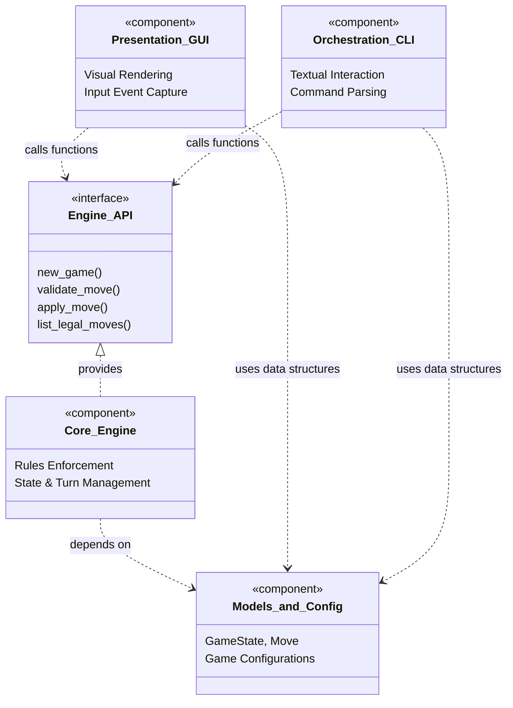

# Team_Summary.md

> **Team Project Summary**  
> *1-2 page overview of your team's project, AI usage, and key results.*

---

## Team Information

**Team Name:** `Team 1 - Review`  
**Project:** Blokus Game Engine (Classic + Duo)  
**Team Members:** 
- Maximilian Alp Grueder
- Anatole Lobenko 
- Nicolas Zevallo

---

## Project Scope & Architecture

### Overview

Briefly describe the scope of your project (incldue toolkit used such as programming language, build tools, editors etc.). What features did you implement? What was the scope of the Blokus Classic and Blokus Duo implementations?

- Python, Bash for Scripting; 
- PyCharm, 
- OpenCode, Codex, Claude Code, Antigravity, Copilot
- Github (Actions), 
- Mermaid for UML 
- Openrouter
- MyPy, Lint, Ruff

### Architecture Diagram

### Key Components

1. **Game Board and Mode Configuration:**
The board is created from ModeConfig, which defines the board size, player order, and starting corners. The implemented Classic mode uses a 20x20 board with four players: blue, yellow, red, and green. This keeps mode-specific values outside the game engine so future Duo support could be added by extending configuration rather than creating a separate engine.
Evidence: config.py, engine.py

2. **Piece Catalog and Transform System:** 
The game defines all 21 Blokus pieces with canonical cell coordinates, then generates unique rotations and flips for each piece. This avoids duplicate symmetric placements and gives the engine a consistent way to calculate occupied board cells for any move.
Evidence: pieces.py, test_pieces.py

3.**Move Validation and Legal Move Generation:**
The engine validates turn order, known players, known pieces, remaining-piece availability, board bounds, overlap, required opening corner coverage, illegal same-color edge contact, and required same-color corner contact after the opening move. Legal move generation uses anchor cells around existing pieces and then reuses the same validator, so generated moves follow the same rules as user-entered moves.
Evidence: engine.py, engine.py, test_engine.py

4. **Game State Management and Serialization:**
GameState stores the complete session: mode, board grid, players, start corners, remaining pieces, move history, current turn, pass count, finished flag, and controller settings. It supports cloning for safe state transitions and JSON-friendly serialization/deserialization for fixtures, CLI usage, and reproducible tests.
Evidence: models.py, models.py, test_serialization.py

5. **Turn Progression, Passing, and Scoring:**  
Applying a move clones the state, writes the piece cells onto the board, removes the piece from the player’s rack, appends to history, advances the active player, and checks whether all players are blocked. Passing is only legal when the current player has no legal move. Scoring is based on remaining squares, with bonuses for emptying a rack and ending with I1.
Evidence: engine.py

6. **CLI Interface:**
The command-line interface exposes the engine through commands for creating a new game, showing a saved state, validating a move, applying a move, passing, listing legal moves, suggesting a computer move, playing interactively, running evaluation, and launching the GUI. It uses JSON files as the main persistence format.
Evidence: cli.py, cli.py, test_cli.py

7. **Computer Player:**
The project includes a simple deterministic computer-player helper. It chooses from legal moves and prefers larger pieces first, making it useful for smoke testing and playable demos without claiming to be a strong Blokus AI.
Specifically, the sorting key forces the AI to prioritize:

-PIECES[move.piece].size (this guarantees it places the largest piece possible)
Followed by coordinate tie-breakers (y, x, rotation, flipped) which ensures the output is rigidly deterministic.
Evidence: players.py, test_ai.py

8. **Test Suite, Fixtures, and Evaluation Harness:**
The test suite covers engine rules, piece transforms, serialization, CLI behavior, AI move selection, GUI support, automation/release helpers, and fixture-backed scenarios. The evaluation harness replays JSON scenario files and checks the expected current player, finished state, history length, consecutive passes, occupied-square counts, and final scores.
Evidence: evaluate.py, test_evaluate.py, README.md

---

## AI Tools Used

### High-Level Overview

Describe which AI tools you used and where. Be specific about the tools/models and how they were integrated into your workflow.

| Phase | AI Tool/Model | Usage | Validation Method |
|-------|---------------|-------|-------------------|
|Throughout|Codex / coding agents|Code generation, refactoring, repair tasks, PR implementation|Unit tests, CI, manual diff review, agentic review|
|Throughout|-GPT-5.x / ChatGPT 5.5|Architecture analysis, documentation, guideline evaluation, review of ambiguous findings|Manual verification, cross-model comparison|
|Documentation|DeepSeek Expert Thinking|Alternative reasoning and comparison for documentation/guideline outputs|Manual comparison against project needs|
|Additional Reviews|Claude Sonnet|Additional review and design/test reasoning| Manual comparison, tests |
Throughout|OpenRouter| Model access for agentic review and implementation experiments | Cost/token tracking, output inspection |
|Review| GitHub Actions | CI/CD, workflow execution, automated review support | Passing CI checks and manual review |
| Design, Requirements, Coding, Debugging, Reviewing | Gemini 3.1 Pro | Code generation, Architecture analysis, LLM as an evaluator/reviewer, Implementation plans, Design, Debugging, Testing, proofreading and documentation | Manual Verification, Tests, LLM as evaluator / reviewer |
| Design, Requirements, Coding, Debugging, Reviewing | Gemini 3 Flash | Code generation, Architecture analysis, LLM as an evaluator/reviewer, Implementation plans, Design, Debugging, Testing, proofreading and documentation | Manual Verification, Test generation, LLM as evaluator / reviewer |
| Design, Requirements, Coding, Debugging, Reviewing | Gemini 3.5 Flash | UML generation, LLM as a Judge for the UML diagrams | Manual Verification, LLM as evaluator / reviewer |
| Design, Requirements, Coding, Debugging, Reviewing | GitHub Copilot on Auto | Planning, Generation, Implementation and generation of relevant test cases. | Manual Verification, Tests, LLM as evaluator / reviewer |
| Design, Requirements, Coding, Debugging, Reviewing | Gemini 3.1 Pro | Code generation, Architecture analysis, LLM as an evaluator/reviewer, Implementation plans, Design, Debugging, Testing, proofreading and documentation | Manual Verification, Tests, LLM as evaluator / reviewer |
| Design, Requirements, Coding, Debugging, Reviewing | Gemini 3 Flash | Code generation, Architecture analysis, LLM as an evaluator/reviewer, Implementation plans, Design, Debugging, Testing, proofreading and documentation | Manual Verification, Test generation, LLM as evaluator / reviewer |
| Design, Requirements, Coding, Debugging, Reviewing | Gemini 3.5 Flash | UML generation, LLM as a Judge for the UML diagrams | Manual Verification, LLM as evaluator / reviewer |
| Design, Requirements, Coding, Debugging, Reviewing | GitHub Copilot on Auto | Planning, Generation, Implementation and generation of relevant test cases. | Manual Verification, Tests, LLM as evaluator / reviewer |

> **Note:** Use these as examples only

### AI Usage Policy

Describe any AI usage policies, guidelines, or constraints your team followed during development. This may also include course-specific requirements, or internal team agreements.

| Policy/Guideline | Description | Application |
|------------------|-------------|-------------|
|Review Agent on Github|We added review agent after initial setup and prototypes, which reviewd every code change. The agent was triggered on Github Actions - PRs. The team reviewed AI finidings and implemented code changes if neeeded|Review, Coding, Debugging

> **Note:** Use these as examples only. Adjust based on your team's actual practices.

---

## Key Results

### What Worked Well

- Agentic review setup, which helped to improve the code
- Thanks to the AI agents, the challenge of completing a project moved from coding proficiency to organisation and communication of intent, which suits better to my strenghts. Completing this project before the introduction of AI agents would have been much harder for me. 
- `[Result 3]`

### What Failed or Was Challenging

- Testing: Ensuring every edge-case beeing tested is difficult. The speed of code generation is higher than the speed of understanding the code/software. 
- Documentation of AI chats, especially when antigravity removed the 'export chat' option. 
- Identifying duplicate tests, or overall stopping the AI agents from generating duplicate 

### Lessons Learned

- LLMs are useful for early prototyping, but generated code must be reviewed and tested before becoming part of the codebase.
-  When the partner in a session is a new agent with no prior context, taking the time to explain the project and the current status is very important. I mostly achieved this by first prompting: "Familiarize yourself with the project, and focus on ..."
- LLMs are great at bouncing ideas off of. They can suggest alternatives and help you think through problems.

---

## Top 3 Counterexamples

Provide links to notable counterexamples where guidelines from other teams did not work as expected.

1. **Counterexample 1:** Low-Value (Maintainability) Artifacts  
   **Link:** Anatole Lobenko - Portfolio. https://github.com/anatol21/Blokus_GenAI/pull/82 and PRs #73 and #74 (Guideline events)
   **Guideline that Failed:** Maintenance - Guideline 5 
   **What Happened:** Applying the documentation guideline produced useful module summaries and some docstrings, but also generated inconsistent user stories, generic risk warnings, and unstable docstring structures. The same prompt was tested with Codex, ChatGPT 5.5, and DeepSeek Expert Thinking. The outputs showed that broad maintainability prompts can overgenerate artifacts that are not operationally useful.

2. **Counterexample 2:** Test all serialization of duo in one detailed, long prompt. Have the LLM agents create an implementation plan and review that plan instead of using many small prompts.  
   **Link:** `Folder mgrueder_addendum/Counter3/ & mgrueder_addendum/Portfolio.mgrueder.md`  
   **Guideline that Failed:** `Atomic Task Decomposition with Systematic Reasoning` from Coding Team. 
   **What Happened:** The guideline "batch large tasks" recommends splitting complex, multi-objective requests into smaller prompt batches. Following this guideline for the Blokus Duo serialization testing task would have required fragmenting the single coherent objective "adapt the entire Classic serialization test suite for Duo mode" into multiple smaller prompts. By instead using a single structured prompt with a built-in review gate (the implementation plan), the task was completed in just three (four if the implementation plan was not approved of and the prompt had to be adjusted accordingly) prompts total.

3.⁠ **Counterexample 3:** ⁠ Interactive Test‑Driven Validation Backfired When the Tests Were Wrong ⁠ 
   **Link:** ⁠ [Link to counterexample documentation] ⁠  
   **Guideline that Failed:** ⁠ Interactive Test‑Driven Validation (TDD‑LLM) — Coding Team, Guideline 2 ⁠  
   **What Happened:** ⁠ I applied the TDD‑LLM approach by giving the LLM the existing fixture‑validation tests together with the broken Duo fixtures, expecting the tests to act as a reliable specification. However, the tests themselves were derived from the same corrupted fixtures — for example, both expected the player colour to be "yellow", even though the engine’s Duo mode requires blue + red. Because the tests encoded the same incorrect assumptions as the fixtures, they acted as a false oracle. The LLM trusted the tests and preserved the wrong value, producing “correct” output that matched the tests but violated the real engine specification. The lesson learned: tests only work as a source of truth when they come from an independent, verified reference. When tests and code share the same flawed origin, TDD‑LLM collapses. ⁠

---

## Classic → Duo Change Request

### Impact on Design

How did the requirement to support Blokus Duo affect your design decisions?

- **Initial Design Decisions:** 
The first implementation focused on Blokus Classic as the baseline: a 20x20 board, four players, fixed starting corners, shared move validation, JSON state persistence, CLI commands, and tests for Classic rules. The core engine was kept separate from the CLI and GUI, which made it possible to later introduce Duo without rewriting the whole game.
- **Changes Made for Duo Support:** 
Duo pushed the design toward a configurable engine. Instead of hard-coding Classic rules everywhere, mode-specific values were moved into ModeConfig: board size, player list, turn order, and starting corners. The commit history shows Duo being added with a 14x14 board, two players, Duo fixtures, CLI support for python -m blokus new --mode duo, GUI mode switching, and Duo-specific tests. Later fixes corrected details such as Duo board size, start positions, player colors, fixtures, restart behavior, and GUI settings.
- **Challenges Encountered:** 
Previous tests were written with Classic-only assumptions, so adding Duo caused persistent test failures. Some tests expected four players, Classic corners, or a 20x20 board. The history also shows corrections around Duo board size, starting positions, fixture expectations, and GUI behavior. The initial setup had a test 'Duo is not implemented yet', which wasn't removed in the transition and caused errors. 
- **Solutions Implemented:** 
The team updated tests and fixtures to make mode-specific expectations explicit. Classic tests continued to protect the original baseline, while Duo tests checked 14x14 setup, two-player state, Duo opening rules, serialization, CLI behavior, and GUI mode switching. Redundant or outdated tests from the pre-Duo phase were removed or adjusted so the suite tested current behavior instead of old assumptions.

### Configuration Approach

How did you implement configuration to support both Classic and Duo modes?

The project uses a ModeConfig data structure in src/blokus/config.py to define each mode. Classic uses a 20x20 board with players blue, yellow, red, and green; Duo uses a 14x14 board with two players, blue and red, and Duo-specific starting corners. The engine calls get_mode_config(mode) when creating a new game, so new_game("classic") and new_game("duo") use the same engine logic with different configuration data. This avoids separate Classic and Duo engines.

### Testing Strategy

How did you update your test suite to cover both modes?

- The test suite was expanded from Classic-only checks to mode-aware testing. Tests verify that new_game() creates the correct board size and players for Classic and Duo, that opening moves must cover the correct mode-specific start corner, and that legal move generation works from the configured starting position. Additional Duo tests were added for CLI creation, validation, legal-move listing, serialization/import-export behavior, fixture replay, and GUI mode switching. The commit history also shows test cleanup after Duo was added, especially removing tests that no longer matched the updated implementation. An Duo integration test was created and successfuly ran. 

---

## Repository Links

- **Project Repository:** https://github.com/anatol21/Blokus_GenAI/
- **Issue Tracker:** https://github.com/anatol21/Blokus_GenAI/issues ; Trello (https://trello.com/b/Huj9XIdp/blokus-grrrrrrr) 
- **CI/CD Pipeline:** https://github.com/anatol21/Blokus_GenAI/actions

---
